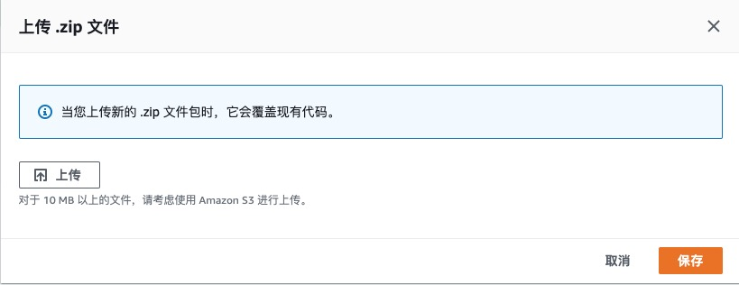
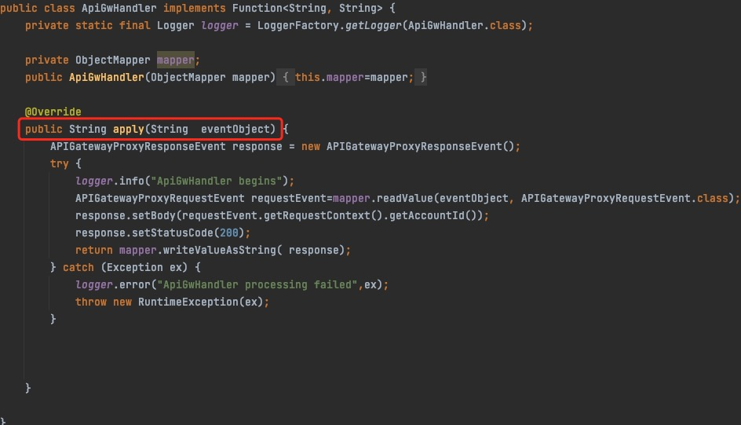

# Lab 14 在Amazon Lambda上通过使用Graalvm，优化基于Spring Boot Function框架项目的冷启动性能
## 部署步骤如下：
### 1.环境说明，详细内容可参考*Dockerfile*与*pom.xml*

### 2.执行build.sh,生成部署文件
```
$ ./build.sh
```
### 3.创建Lambda函数，输入函数名称，并使用定制运行时*Amazon Linux2*

### 4.编辑运行时设置，在处理程序处输入*apiGwHandler*，该内容与来*com.example.demo.DemoApplication.java*定义的bean名称要一致


### 5.选择build目录下生成的*lambda-spring-cloud-function-graalvm-0.0.1-native-zip.zip*文件上传，并保存

### 6.配置测试事件，并选择事件模版*apigateway-aws-proxy*进行测试

### 7.系统将触发*com.example.demo.function.ApiGwHandler*类的apply方法

