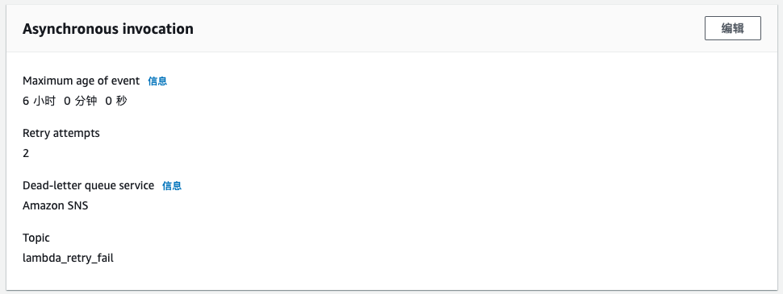

# Lab 3 Amazon S3 自动转换图片格式（ Lambda Layer与环境变量，CDK部署）
Amazon S3 存储桶 input 目录新增文件自动触发 AWS Lambda。Lambda 取 S3 文件做转换并存回去 S3 同一个桶的 output 目录下。本 Lab 使用 Python Pillow 做图片转换，读者可以参考 Pillow 文档进行功能扩展。  
## 实现以下功能
### 转换格式
指定以下格式转换，或者选择保留原图格式
* Full Suported image formats: BMP, DIB, EPS, GIF, ICNS, ICO, IM, JPEG, JPEG 2000, MSP, PCX, PNG, PPM, SGI, SPIDER, TGA, TIFF, WebP, XBM
* Read-only formats: BLP, CUR, DCX, DDS, FLI, FLC, FPX, FTEX, GBR, GD, IMT, IPTC/NAA, MCIDAS, MIC, MPO, PCD, PIXAR, PSD, WAL, XPM
* Write-only formats: PALM, PDF, XV Thumbnails  

更多详情参考 Pillow 文档: https://pillow.readthedocs.io/en/stable/handbook/image-file-formats.html

### 转换图像大小
* 指定图像宽度和高度进行转换
* 按原图的百分比进行缩放
* 可选择是否保留原图的纵横比 Ratio

### 控制图像质量
* 输出 JPEG，WebP 等图像格式式指定输出的图像质量，即压缩率  
* 输出为 JPEG 渐进式格式

### 其他功能
* 自适应旋转图像。根据原图的 Exif 信息，自动旋转图像
   
## 配置步骤如下：  
1. 新建 S3 桶
新建一个 Amazon S3 的存储桶。用于存放上传的文件和转换后的文件。  
本 Lab 的代码会针对该桶的 input/ 目录提取文件，并把转换后的文件存放在该桶的 output/ 目录。  

2. 创建 IAM 角色
创建一个 IAM Role 给 Lambda 运行使用，具有读写 S3 的权限和写 Log 的权限。参考 [policy.js](./policy.js)

3. 创建 Lambda 函数  
创建一个 Lambda 函数，代码见 [lambda_handler.py](./lambda_handler.py)
设置运行环境为 Python3.7，运行内存 256MB，运行超时时间 5 分钟。  

4. 设置 Lambda 环境变量  
该 Lambda 函数引用了以下的环境变量作为转换方式的配置，请配置以下的环境变量，可参考以下值配置：  
    * `preserv_original_format = False`   
    True: 自动检测并保留原图格式和文件后缀  
    False: 转换图像格式为以下格式  
    * `convert_format = 'WebP'`  
    转换的目标图像格式  
    * `convert_postfix = '.webp'`  
    转换后的图像文件后缀  
    * `resize_feature = 'FixSize'`  
    Disable: 不转换大小   
    Percentile: 基于以下百分比转换大小，并保持纵横比    
    FixSize: 基于以下指定大小来转换，并保持纵横比   
    PercentileNoRatio: 严格按以下百分比转换大小，不保持纵横比   
    FixSizeNoRatio: 严格按以下指定大小来转换，不保持纵横比  
    * `resize_Percentile_w = 0.5`  
    宽度百分比大小 0-1 值  
    * `resize_Percentile_h = 0.5`  
    高度百分比大小 0-1 值  
    * `resize_FixSize_w = 640`  
    指定宽度，像素  
    * `resize_FixSize_h = 640`  
    指定高度，像素  
    * `save_quality = 95` 
    输出的图像质量，即压缩率，针对 JPEG, WebP 等支持 quality 参数的格式，值 0-100，网页展示用可设置 80  
    * `jpeg_progressive = True`  
    是否启用 JPEG 的渐进式格式  
    * `auto_orientation = True`  
    是否启用基于图像 Exif 信息的，自适应旋转功能  
    如果启用，但图像 Exif 中没有 Orientation 信息，则该功能不生效  
  
以下为环境变量配置界面示例：  

   是否觉得界面配置这么麻烦？可以使用本项目带的 env.js 文件，用命令行部署或者使用本文后面的 CDK 方式。
* TODO: Watermark with text, image  
* TODO: Blur, Contract, Bright, Sharp, Rotate  
  
### 配置依赖的层（Pillow包）
* 下载 Pillow 包，并在 docker 环境下运行再打包 zip，这样保证打包环境跟 lambda 的 python3.7 版本的环境一致。请先运行 docker。如果不方便运行 docker 可以参考下面的 Layer 创建说明。  
```
docker run -it \
    -v $$PWD:/var/task \
    lambci/lambda:build-python3.7 \
    /bin/bash -c 'pip install Pillow -t ./python/'

docker ps -a
```
找到显示的运行的 container 的id号，替换下面的{{container id}}


```
docker cp {{container id}}:/var/task/python/ .
zip -r9 python-pillow.zip ./python
```

如果不方便自己下载，可以采用本Lab准备好的包：
[python-pillow.zip](./python-pillow-6.2.1.zip)  

* 创建 Lambda Layer  
在 Lambda 界面，左侧菜单 “层”（Layer），创建层。  
上传 python-pillow.zip 文件，并标注一下兼容运行时为 Python 3.7  
  
  

* 将 Lambda 函数关联 Layer  
  进入刚才新建的 Lambda 函数界面，将函数关联刚才创建的层  

  

更多关于如何创建和管理层，可以参见：  
https://aws.amazon.com/cn/blogs/china/use-aws-lambda-layer-function/
https://docs.aws.amazon.com/lambda/latest/dg/configuration-layers.html

### 设置 S3 触发 Lambda
* 设置 S3 触发 Lambda  
在 Lambda 函数界面点击“添加触发器”，选择 S3，并选择 S3 桶，配置前缀"input/"，对 S3 ”新增“ 文件进行触发。  

  
### 测试上传文件  
尝试调整环境变量中各种参数：  
* 上传 JPG 文件转换格式为 WebP  
* 保留原 JPG 格式，只改变大小为指定大小 640*640，保留纵横比  
* 转换格式以及改变大小，并且不保持纵横比  

在 S3 桶中，创建一个“input”目录，并上传图像文件到该目录中，查看该 S3 桶“output”目录下新输出的文件。  

### 配置 DLQ   
S3 上传一个文件就会触发一次 Lambda，如果处理失败会自动重试两次。当大量文件同时进入 S3 的时候，同时触发多个 Lambda。AWS 账号中默认 Lambda 并发 Limit 是 1000，此时如果并发请求超过1000，Lambda 服务会拒绝部分的请求。如果重试两次依然失败，默认则会丢弃触发消息了。  
处理失败有几种可能，  
* 可能是并发请求过多，重试2次仍然失败；  
* 可能是代码逻辑问题，导致 Lambda 运行异常中断而且代码中没有捕捉到；  
* Lambda 配置的超时时间过短，或者配置的内存过小导致异常；  

最佳实践是对 Lambda 配置死信队列 Dead Letter Queue (DLQ)，使失败消息进入 SQS 或 SNS 队列，避免重试失败后消息丢弃。  
例如 DLQ 发送到 SNS，SNS 一方面发送邮件通知到管理人员，同时又发送消息进入一个待处理的 SQS 队列，待后续重新处理。  
对于能判断是由于并发溢出的正常消息，可以用另外一个 Lambda 对 SQS 里面的消息进行处理。配置 DLQ 界面如下：  



Lambda 能写 DLQ 需要考虑增加对应的 IAM 角色权限：  
* sns:Publish  
或
* sqs:SendMessage  

### 监控并测试并发限制  
我们可以通过限制 Lambda 函数并发数量，来模拟 Lambda 并发超过阀值开始拒绝请求的情况。例如配置 Lambda 的并发控制只允许2个并发  
  


同时上传多个文件到 S3 桶，然后通过 Lambda 监控界面可以观察，ConcurrentExecutions 并发数量，Throttles 限流，DeadLetterErrors 死信消息，Error count and success rate 等。

## 使用 AWS CDK 部署
使用 CDK 可以方便地管理、部署和更新资源，并且比 CloudFormation 更容易 Debug，速度还更快。  
本 Lab 附带了 Python 编写的 CDK 样例在 ./cdk 目录下面，按以下步骤即可完整部署：  
1. 本地电脑上新建一个项目目录，并且初始化 CDK，例如  
```
mkdir cdk_img_process && cd cdk_img_process && cdk init app --language=python  
```
2. 把这些文件拷贝到新建的目录下，并替换原文件  
* setup.py
* env.js
* ./lambda/lambda_function.py
* python-pillow-6.2.1.zip 
* ./cdk_img_process/cdk_img_process_stack.py  
注意如果你的项目目录名称不是"cdk_img_process"，则 cdk_img_process_stack.py 文件不要直接替换，请打开文件替换里面的内容，但保留 class 的名称，如： class xxxxxxxStack  
注意保持以上目录结构。  
  
3. 创建虚拟环境，并安装依赖
```
python3 -m venv .env
source .env/bin/activate
pip install -r requirements.txt
cdk bootstrap
```
4. 部署  
```
cdk deploy
```
可以在控制台上看到新建了 CloudFormation Stack 并且创建了对应资源，大约3分钟后，创建完成。  
如果需自己定义 Bucket 名称或者 Lambda 函数名称，可以打开 cdk_img_process_stack.py ，看里面的提示信息修改。  
5. 一键清理所有资源  
```
cdk destroy
```
更多关于如何使用 CDK 的信息可以参考本 github 的 Lab9-CDK_with_API+Lambda+DDB
