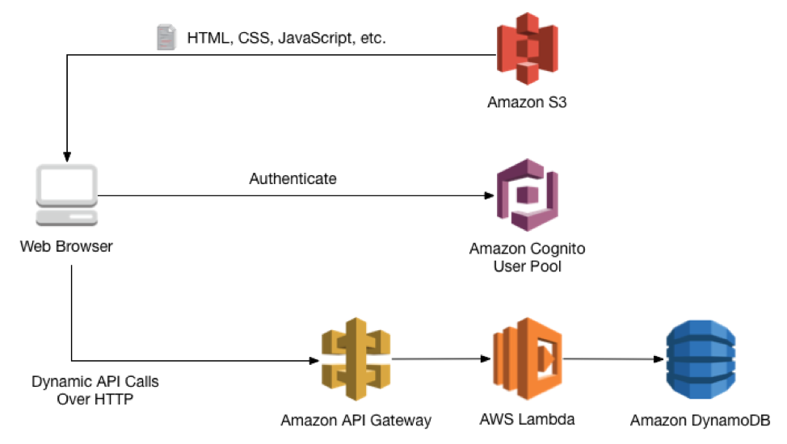
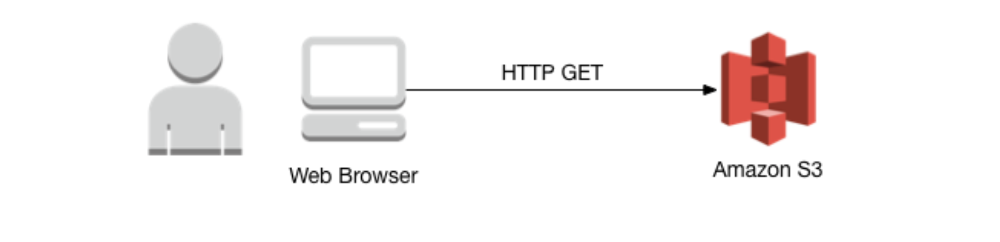
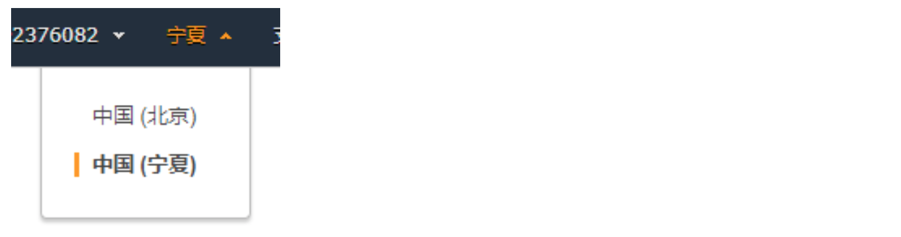
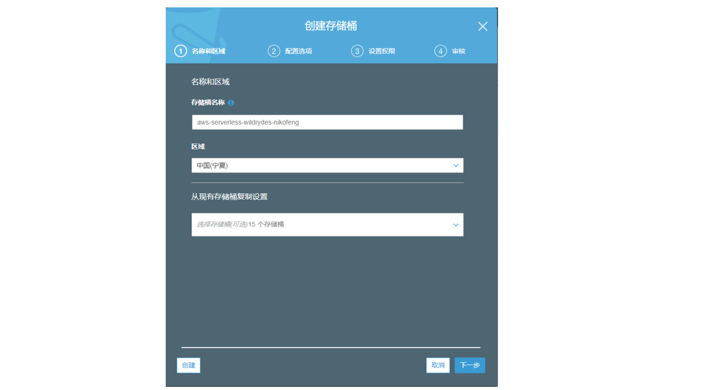
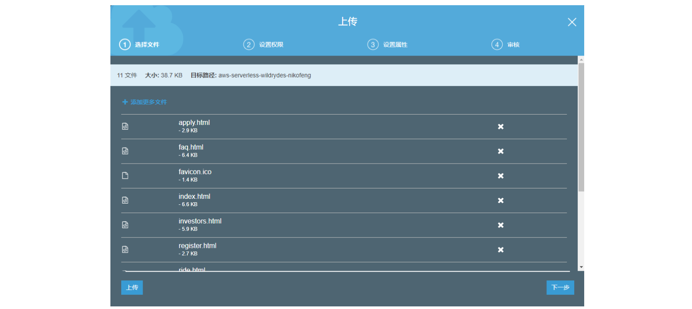
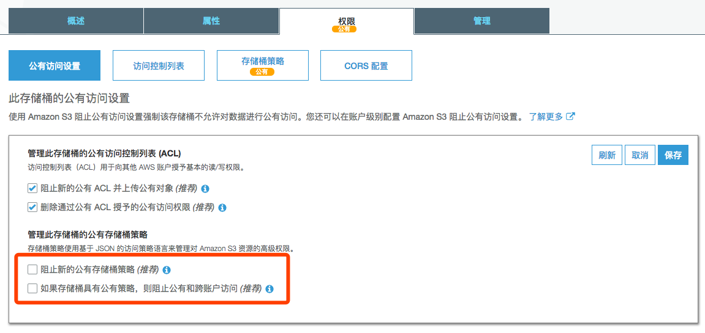
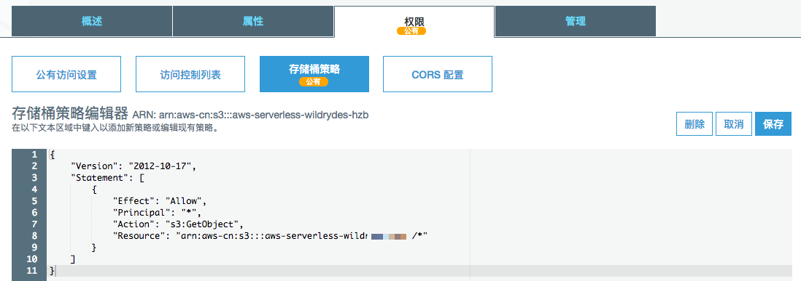
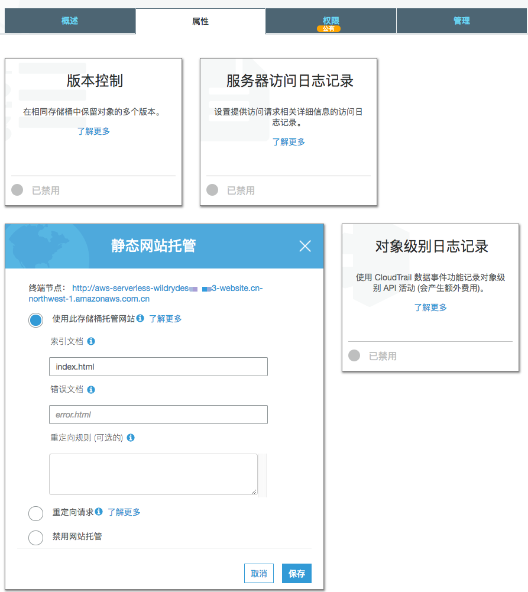
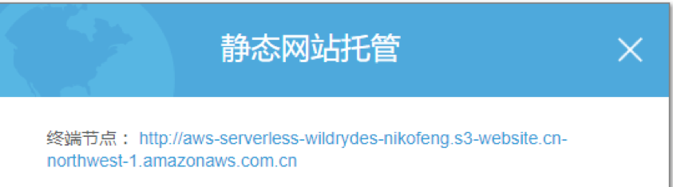

# Serverless Web 应用（动静分离）
This lab is to build a simple web application(Wild Rydes).  
## 前言
在本实验中，将部署一个简单的Web应用程序(Wild Rydes)，使用户可以请求发送一个独角兽。该应用将向用户提供web界面，用户点击他们想要获取的位置，并向后端RESTful Web服务接口发起请求。

使用 AWS Lambda，Amazon API Gateway，Amazon S3，Amazon DynamoDB。 S3托管静态 Web 资源，包括在用户浏览器中加载的 HTML，CSS，JavaScript 和图像文件。在浏览器中执行的 JavaScript 向 API Gateway 发起动态请求，触发 Lambda 处理，并在 DynamoDB 进行数据持久。

架构如下。目前本实验暂不涉及 Cognito 这部分。  

该实验分为4节，您需要完成前一节的模块部署再进行下一节。
* 静态网站托管
* 无服务器后台
* RESTful API 集成

## 第一节：Amazon S3静态网站托管

您将配置 Amazon Simple Storage Service（S3）以托管Web应用程序的静态资源。下一节您将使用 JavaScript 为这些页面添加动态功能，以调用 Amazon API Gateway 构建的 RESTful API。

### 架构概览
该架构非常简单。所有静态Web内容（包括HTML，CSS，JavaScript，图像和其他文件）都将存储在Amazon S3中。最终用户将使用Amazon S3公开的URL访问您的网站。您无需运行任何Web服务器或使用其他服务即可使您的站点可用。

您将使用Amazon S3网站端点URL。它的格式为http：// {your-bucket-name} .s3-website- {region} .amazonaws.com.cn。对于大多数生产环境，您需要使用自定义域来托管您的站点。

### 创建S3存储桶

请选择对应的区域，以下示例宁夏区域进行实验，请保证您所部署的所有AWS资源都会在宁夏区域部署。在开始之前，请确保从AWS控制台右上角的下拉列表中选择您所在的区域。

  
Amazon S3可用于托管静态网站，而无需配置或管理任何Web服务器。在此步骤中，您将创建一个新的S3存储桶，用于托管Web应用程序的所有静态资产（例如，HTML，CSS，JavaScript和图像文件）。  
  
使用控制台或AWS CLI创建Amazon S3存储桶。请记住，您的存储桶名称必须在所有地区和客户中具有全球唯一性。我们建议使用像`aws-serverless-wildrydes-<your name>`这样的名称。如果您收到存储桶名称已存在的错误，请尝试添加其他数字或字符，直到找到未使用的名称。

Step-By-Step 操作指引  
1. 在AWS管理控制台中，选择服务，然后在存储和内容分发下选择S3。
2. 选择创建存储桶
3. 为您的存储桶提供全局唯一名称，例如`aws-serverless-wildrydes-<your name>`
4. 从下拉列表中选择您选择用于此实验的区域 – 中国（宁夏）
5. 选择对话框左下角的“创建”，而不选择要从现有复制设置的存储桶

### 上传网页文件  
将此模块的网站资产上传到S3存储桶。您可以使用AWS管理控制台或者AWS CLI来完成此步骤。如果您已在本地计算机上安装并配置了AWS CLI，我们建议您使用AWS CLI。 
  
通过控制台上传实验文件  
1. 通过如下链接下载本次实验的文件内容  
[WildRydes-aws-serverless-workshop.zip](./WildRydes-aws-serverless-workshop.zip)  
1. 解压缩后把tutorial文件夹（不包含tutorial文件夹）内的所有内容通过网页控制台上传到刚才创建的S3存储桶内,可以直接全选文件夹内的所有内容，通过鼠标拖拽到上传界面。请不要通过“上传文件”按钮的方式上传文件，那样无法选择文件夹。请保证内容里的所有文件（包括文件夹）都在上传范围内。当然，你可以使用 AWS CLI 命令行上传。

3. 点击上传等到文件全部导入S3存储桶内

### 添加存储桶策略允许公开访问  
您可以使用存储桶策略定义谁可以访问S3存储桶中的内容。存储桶策略是JSON文档，用于指定允许哪些主体对存储桶中的对象执行何种操作。   
  
请参阅如下示例，该策略将授予对匿名用户的只读访问权限。此示例策略允许Internet上的任何人查看您的内容。  
1. 选择存储桶，选择权限选项卡，选择公有访问设置选项卡。取消“管理此存储桶的公有存储桶策略“的两个勾选。
  

  
2. 选择存储桶策略，在存储桶策略编辑器中粘贴如下代码示例，确保在Resource中替换您存储桶的名字，点击保存  
  

    {
        "Version": "2012-10-17",
        "Statement": [
            {
                "Effect": "Allow",
                "Principal": "*",
                "Action": "s3:GetObject",
                "Resource": "arn:aws-cn:s3:::您的存储桶名称/*"
            }
        ]
    }

### 开启静态网站托管
默认情况下，S3存储桶中的对象可通过结构为  
`http://aws-serverless-wildrydes-<name>.s3-website.cn-northwest-1.amazonaws.com.cn` 的URL提供。要从根URL（例如/index.html）访问，您需要在存储桶上启用静态网站托管。您还可以为您的网站使用自定义域名。例如，`http://www.wildrydes.com` 托管在S3上。本研讨会不涉及设置自定义域名，您可以在我们的文档中找到详细说明。
开启静态网站托管操作指引：
1. 选择存储桶，选择属性选项卡，找到静态网站托管的选项
2. 点击静态网站托管，选择“使用此存储桶托管网站”
3. 在索引文档里填入“index.html”作为默认主页
4. 点击保存

检查网站托管内容  
完成这些步骤后，您应该可以通过访问S3存储桶的网站端点URL来访问您的静态网站。  
选择静态网站托管页里终端节点，点击打开网页  
   
打开后可以看到我们网站托管的内容，恭喜您，已经成功托管了一个静态网站在AWS上！！！  

    
    
   
下一节：[搭建无服务器后台](./readme2.md)
  
----------------------
整理 by Huang, Zhuobin; Chen, Dave; Zhang, Bob