## 第二节：搭建无服务器后台
您将使用 AWS Lambda 和 Amazon DynamoDB 构建应用后端。您在第一节中部署的应用程序允许用户请求将独角兽发送到他们选择的位置。为了满足这些请求，浏览器中运行的JavaScript需要调用在云中运行的服务。  
  
您将实现一个Lambda函数，每次用户请求一个独角兽时都会调用该函数。该函数将选择一个独角兽，在DynamoDB表中记录请求，然后使用有关正在调度的独角兽的详细信息响应前端应用程序。  
  
使用Amazon API Gateway从浏览器调用该函数。您将在下一个模块中实现该连接。对于这个模块，你只需要单独测试本模块的功能。  

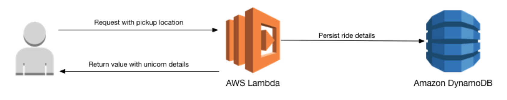

### 创建DynamoDB表结构
1. 在AWS管理控制台中，选择“服务”，然后在“数据库”下选择“DynamoDB”
2. 进入DynamoDB主界面后，选择“创建表”
* 表名称：Rides（注意大小写敏感）
* 主键（分区键）：RideId（注意大小写敏感），类型选择为“字符串”
* 表设置: 勾选“使用默认设置”  
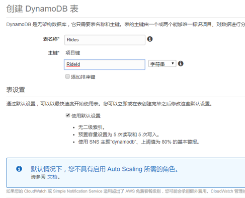  
* 点击“创建”
* 在表详细信息栏里获取资源名称 ARN , 把对应的值记录下来将会用在下一个操作
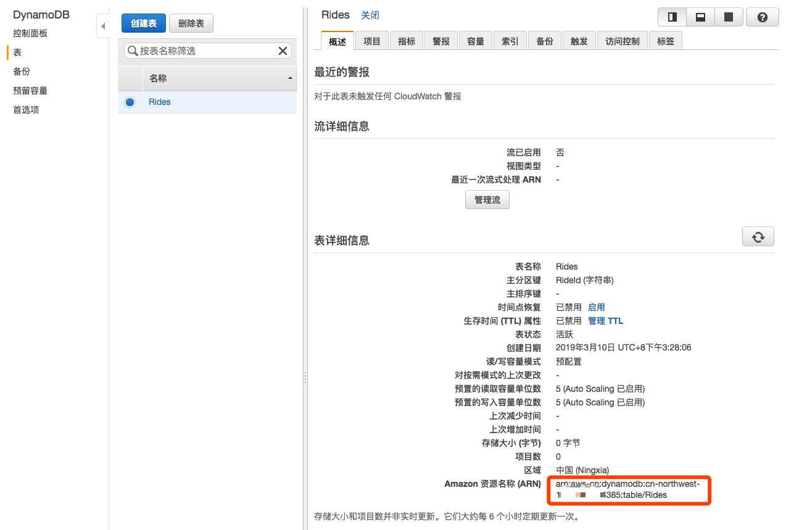


### 创建 Lambda 函数需要使用的 IAM 角色
每个Lambda函数都有一个与之关联的IAM角色。此角色定义允许Lambda函数访问其他相关的AWS服务。您需要创建一个IAM角色，授予您的Lambda函数权限，以便并访问DynamoDB表，以及写入日志到CloudWatchLogs。  
1. 在AWS管理控制台中，单击“服务”，然后在“安全性&身份”部分中选择IAM
2. 在左侧导航栏中选择“角色”，然后选择“创建角色”
3. 从AWS服务组中为角色类型选择Lambda，然后单击“下一步：权限”
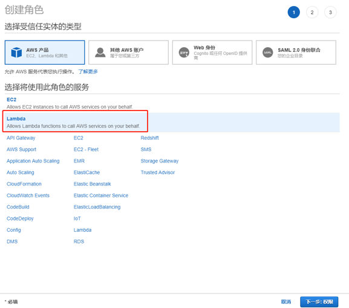
4. 在“Attach权限策略”中，通过搜索栏键入“AWSLambdaBasicExecutionRole”，当搜索结果出来后勾选此项，并点击“下一步：审核”  
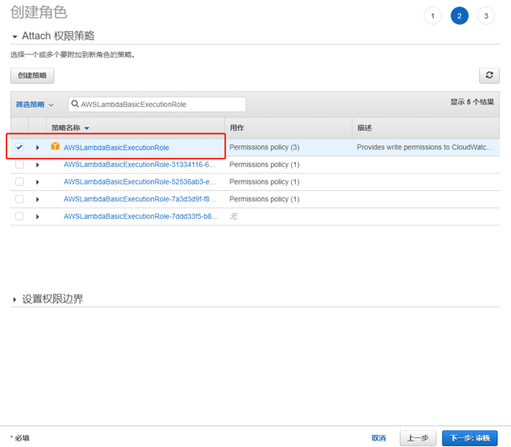
5. 在审核信息中填入如下内容  
角色名称：WildRydesLambda  
角色描述: 可留空或者填写自定义描述  
6. 点击“创建角色”
7. 创建完成后可以通过角色搜索栏搜索“WildRydesLambda”，点击进去查看角色摘要
   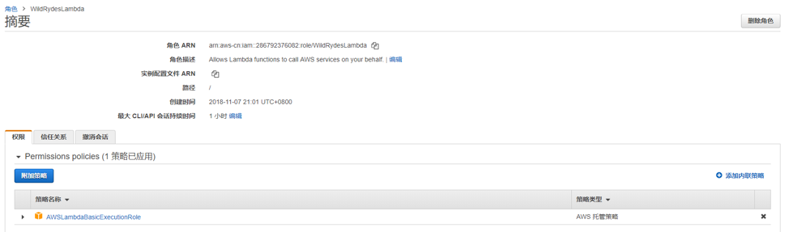 
8. 点击“权限”选项页里右侧的“添加内联策略”创建允许往DynamoDB写的权限
   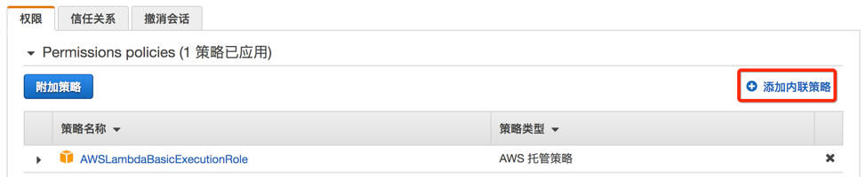 
9. 在“可视化编辑器”中填写如下信息  
o	服务：DynamoDB  
o	操作：PutItem，可在搜索栏上筛选PutItem  
o	资源：选择“特定”，点击“添加ARN”，输入刚才创建DynamoDB表后记录下来的ARN信息  
o	填写完ARN后，Region, Account, Table name这三个字段会自动填充。    
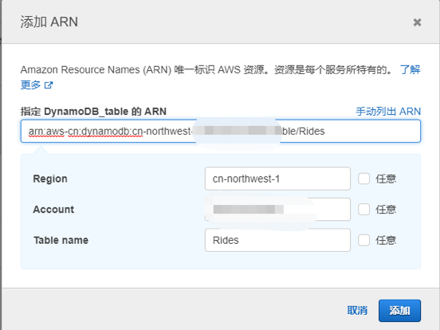 
10. 点击“添加”，然后“查看策略”
11. 输入名称“DynamoDBWriteAccess”，然后点击“Create Policy”
12. 创建结束后在“权限”选项页里可以看到已经成功添加了“DynamoDBWriteAccess”策略
    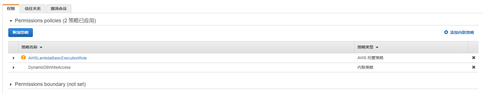 

### 创建用于处理请求的Lambda函数

AWS Lambda 将运行您的代码以动态响应HTTP请求。在此步骤中，您将构建核心功能，该功能将处理来自Web应用程序的API请求以分派独角兽。

1. 选择服务，然后在计算部分选择Lambda。
2. 选择“创建函数”
3. 选择“从头开始创作”，并填入一下内容  
o	名称：RequestUnicorn  
o	运行语言：Node.js 6.10  
o	角色：选择现有角色  
o	现有角色：WildRydesLamdba  
4. 填入完成后，点击“创建函数”
5. 向下滚动到“函数代码”部分，并将index.js代码编辑器中的现有代码替换为aws-serverless-workshop.zip压缩包下lambda文件夹的index.js代码
6. 点击页面右上角“保存”

### 验证Lambda函数
1. 在功能的主编辑屏幕中，从“选择测试事件 ...”下拉列表中选择“配置测试事件”。
 
2. 勾选“创建新测试事件”，事件模板选择默认的“Hello World”,“事件名称”填入 TestRequestEvent
3. 将以下测试事件复制并粘贴到编辑器中  
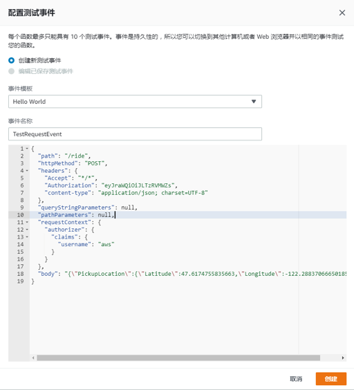
```
    {
    "path": "/ride",
    "httpMethod": "POST",
    "headers": {
        "Accept": "*/*",
        "Authorization": "eyJraWQiOiJLTzRVMWZs",
        "content-type": "application/json; charset=UTF-8"
    },
    "queryStringParameters": null,
    "pathParameters": null,
    "requestContext": {
        "authorizer": {
        "claims": {
            "username": "aws"
        }
        }
    },
    "body": "{\"PickupLocation\":{\"Latitude\":47.6174755835663,\"Longitude\":-122.28837066650185}}"
    }
```
4. 点击“创建”
5. 在主功能编辑屏幕上，单击下拉列表中选择的TestRequestEvent
6. 点击“测试”
7. 滚动到页面顶部，展开“执行结果”部分的“详细信息”部分
8. 验证执行是否成功，并且函数结果如下所示：
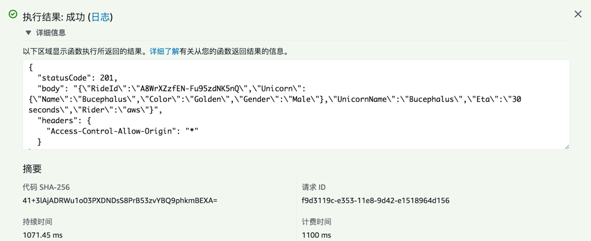
  
    

      
下一节：[集成API Gateway](./readme3.md)