## 第三节：集成API Gateway 构建RESTful APIs

在本单元中，您将使用 API Gateway 将您在上一节中构建的 Lambda 函数开放为 RESTful API 并在 Internet 上可访问。  
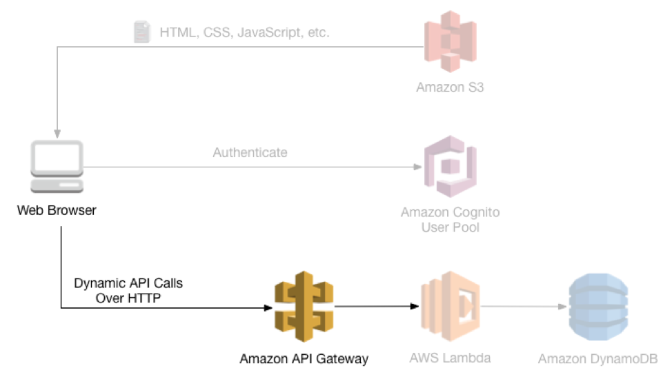
上图显示了您将在本节中构建的 API Gateway 组件如何与先前构建的现有组件集成。灰色项目是您在之前步骤中已实施的部分。  

您在第一节中部署的静态网站已经显示了一个静态页面，该页面被配置为与您将在本节中构建的 API 进行动态交互。   
/ride.html  上的页面有一个简单的基于地图的界面，用于请求独角兽骑行。用户可以单击地图上的某个点来选择他们的取件位置，然后通过选择右上角的“Request Unicorn”按钮来发起请求。  
  
  
操作步骤：
  
### 通过API Gateway创建REST API
1. 在AWS管理控制台中，单击“服务”，然后在“应用程序服务”下选择“API Gateway”
2. 选择“创建API”
3. 在“新建API”设置页面填入以下信息  
o	勾选“新建API”  
o	API名称：WildRydes  
4. 点击“创建API”完成操作  
   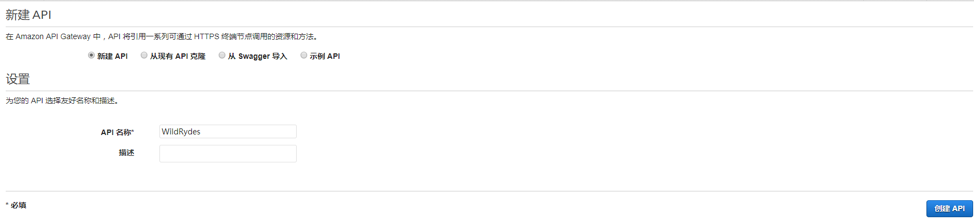

### 创建 API Resource (资源)和 Method (请求方法)
在API中创建名为 /ride 的新资源, 然后为该资源创建一个 POST 方法，并将其配置为 Lambda RequestUnicorn 函数代理集成。

1. 在左侧导航栏中，单击WildRydes API下的“资源”。
   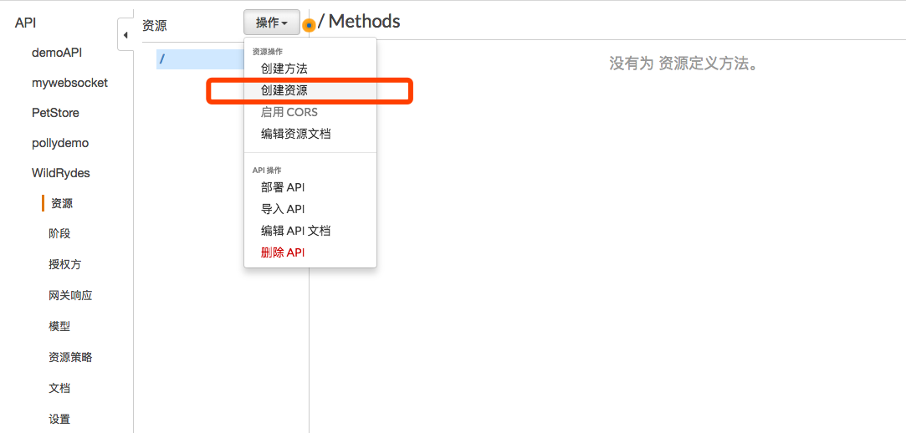
2. 从“操作”下拉列表中选择“创建资源”。
3. 在“新建子资源”页面上填入如下信息  
o	资源名：ride    
o	资源路径：/ride  
o	勾选“启用API Gateway CORS”  
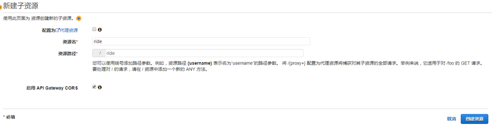
4. 点击“创建资源”
5. 选择新创建的 /ride 资源后，从“操作”下拉列表中选择“创建方法”
6. 选中显示的新下拉列表中的POST方法
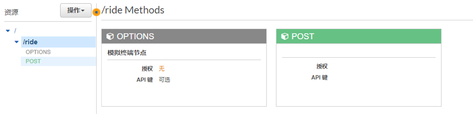
7. 点击“POST”方法进入设置页面，填入如下信息  
o	集成环境：Lambda函数  
o	勾选 “使用Lambda代理集成”  
o	Lambda区域：cn-northwest-1  
o	Lambda函数：RequestUnicorn  
o	勾选“使用默认超时”  
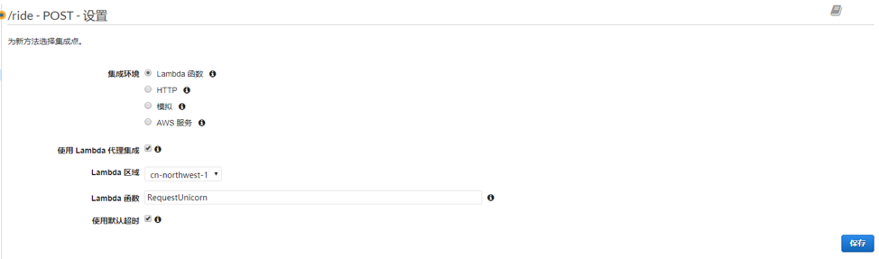
8. 点击“保存”
9. 在弹出的确认框里，点击“确定”授予API Gateway调用Lambda函数的权限
10. 在“操作”下拉列表中，选择“部署API”
    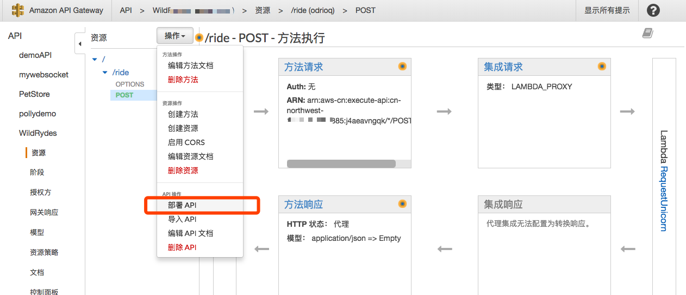
11. 在部署API页面中填入如下信息
o	部署阶段：新阶段  
o	阶段名称：prod  
12. 点击“部署”
13. 记录“prod阶段编辑器”的调用URL，这个URL就是API暴露到公网的访问地址。后续需要用到（如下图所示）。
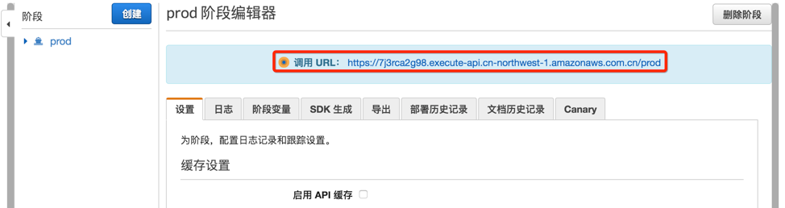

### 更新网页应用的配置
修改/tutorial/js/config.js 文件，将刚才部署的API调用URL填入invokeUrl

    window._config = {
        api: {
            invokeUrl: '[上一步里记录的调用URL地址]'
        }
    };

保存后上传到S3存储桶下相同的目录覆盖原有的config.js  
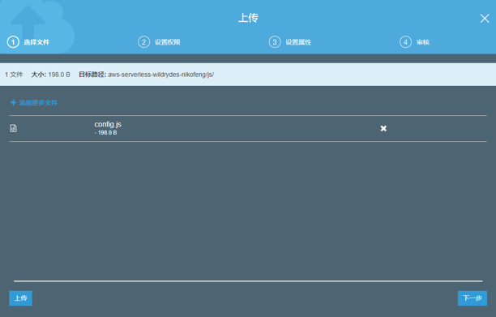

### 验证集成实现

在AWS管理控制台中，单击“服务”，然后在“存储和内容分发”下选择“S3”  
选择实验创建的存储桶，选择“属性”，选择“静态网站托管”  
点击终端节点跳转到网页应用执行验证  
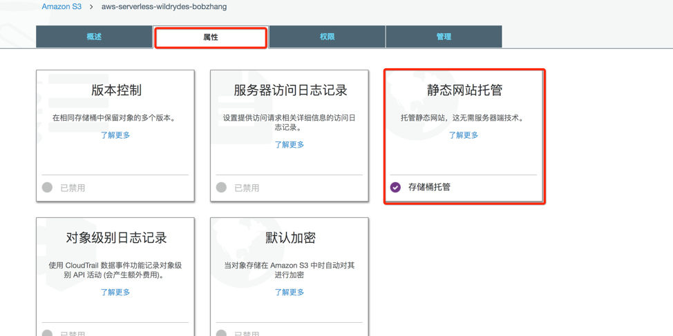
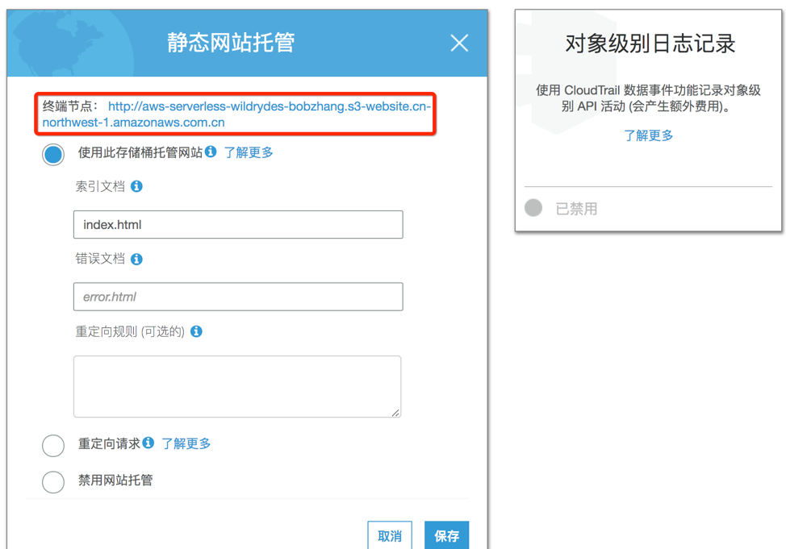

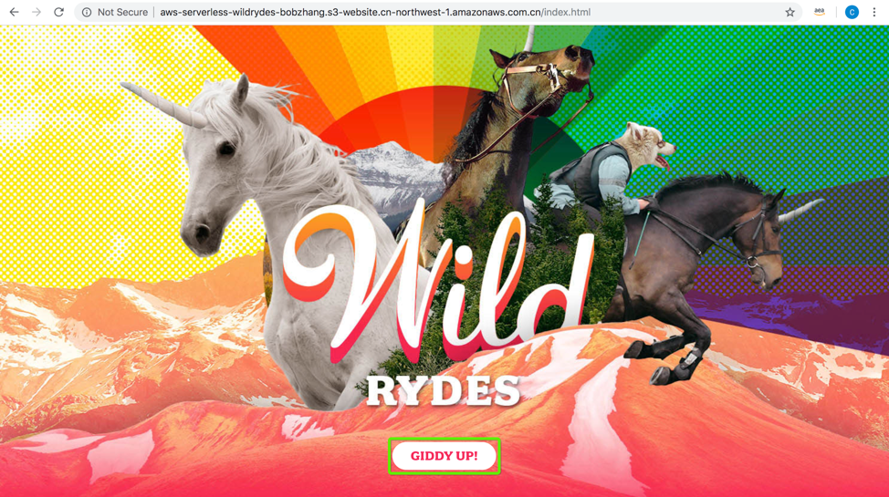
点击“GIDDY UP!”，进入下一个测试页面

如果一切正常，会看到一张地图  
在图中地图上任意一点点击鼠标左键，设定一个地点，如下图：
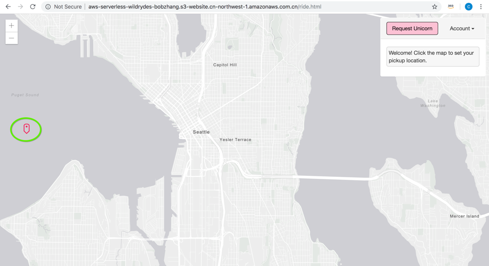
点击右上角的“Request Unicorn”,会发现有个马从一个角落跑出来到上一步设定的地点，并且右上角出现一些文字提示，提示前来接驾的马的颜色等信息。
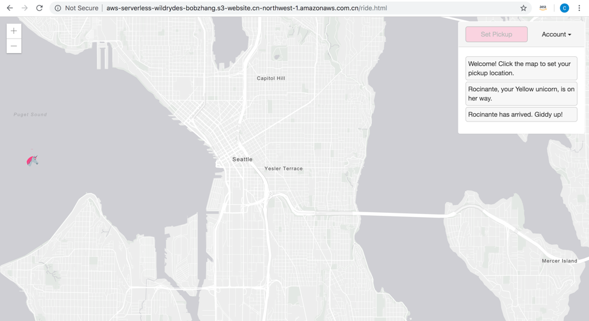
至此，基于S3 + API gateway + Lambda + DynamoDB的第一个serverless应用搭建完成！该应用为serverless架构，您无需管理任何服务器，只需进行应用代码编写和一些简单的配置，即可实现一个动态伸缩、高可用、按实际使用量付费的架构！

您可以进一步到 DynamoDB 界面上查看写入的数据库记录。然后进入下一节，了解 Lambda 和 API Gateway 更多的运维知识。

下一节：[监控、版本管理与灰度发布](./readme4.md)