## Lambda 和 API Gateway 的监控、版本管理与灰度发布

AWS Lambda 可以实现监控，日志记录，多版本管理和灰度发布，以下步骤将带您了解具体操作。  

1. 监控  
在 Lambda 控制台界面上点击“监控”，这里看到调用数量、时长、错误率、节流、迭代、死信消息、并发数量等指标。
点击logs，会自动新建一个窗口，并打开对应 CloudWatchLogs 的流日志，记录了 Lambda 输出日志的所有信息。
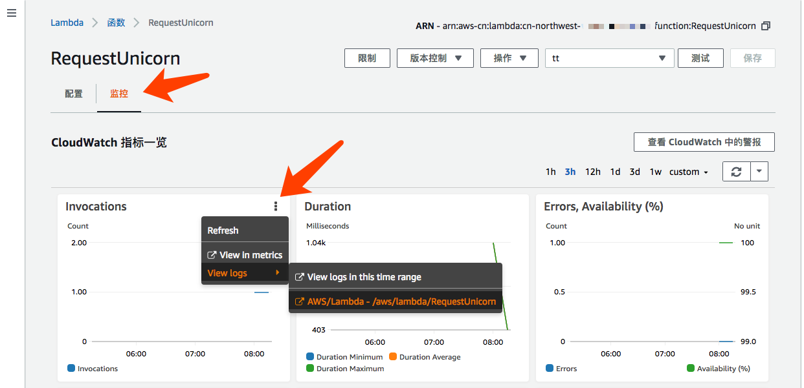 

2. Debug  
* 对于超时错误，适当调整 Lambda 的超时时间，以及调整运行内存可以加快 Lambda 的运行速度（因为有更多的CPU资源）。另外，除非必须要访问VPC内部的资源，否则并不需要配置VPC模式，因为VPC模式会增加 Lambda 的启动时间；  
* 对于并发控制限流的情况，可以适当调整该函数的并发数量；  
* 建议设置DLQ（死信队列），对于 Lambda 不能正常运行的情况，就会被消息转入DLQ，存入SQS（或SNS）。并增加额外的处理机制对DLQ里面的小心进行分析和处理。
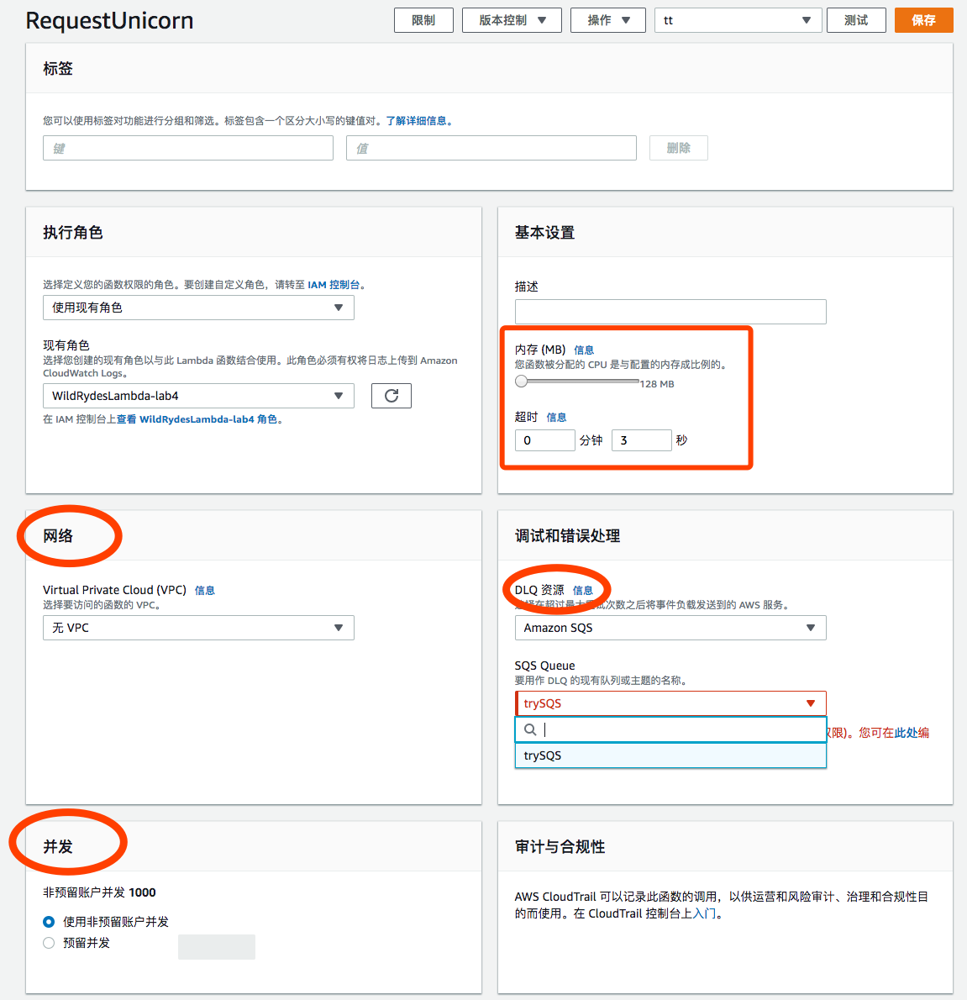

3. 函数完成调试后，可以发布成为新版本（该版本就不再变更了）。  
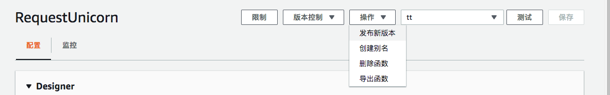    
并创建新的别名，例如 prod（生产环境）指向发布的版本（例如版本1）。  
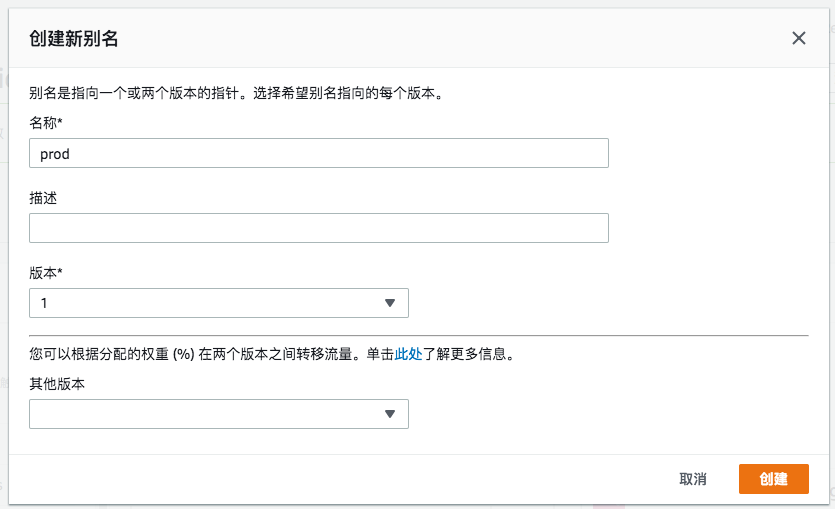  
这样外部调用的时侯，应该指向的是 prod 版本，而不是最新修改的开发版本。所以此时应该到 API Gateway 的界面中，把 API Gateway 集成的 Lambda 函数修改为 prod 版本的 ARN  
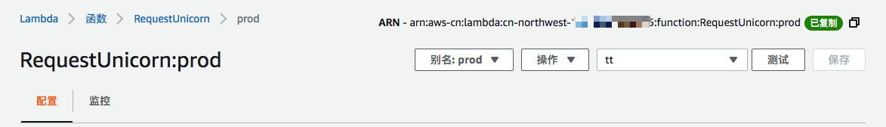  

4. 灰度发布  
灰度发布是指在新旧两个版本之间，能够平滑过渡的一种发布方式。在其上可以进行 A/B 测试，即让一部分用户继续用产品特性A，一部分用户开始用产品特性B，如果用户对B没有什么反对意见，那么逐步扩大范围，把所有用户都迁移到B上面来。灰度发布可以保证整体系统的稳定，在初始灰度的时候就可以发现、调整问题，以保证其影响度。  
当我们对 Lambda 函数做了修改，我们可以再发布一个新版本，版本2。然后修改别名 prod，设置“其他版本”为版本2，并且权重为 5%。这样就实现了新版本5%的流量，老版本95%流量的灰度发布。
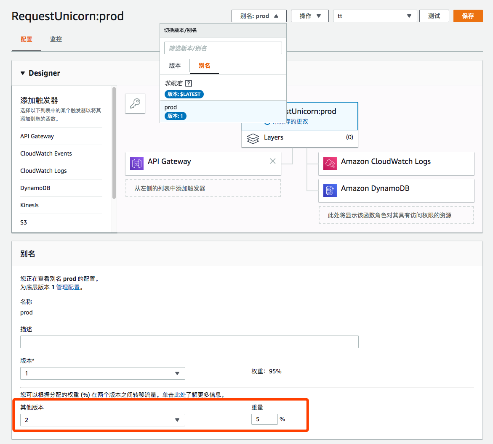  

1. 启用 API Gateway 日志记录  
API Gateway 支持发送日志到 CloudWatchLogs 上，设置如下   
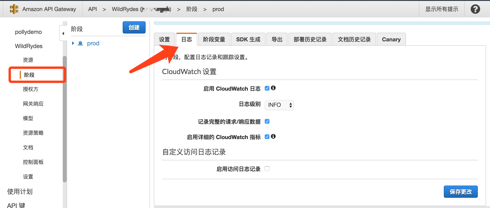    

6. 监控 API  
打开 API Gateway 的监控界面进行监控
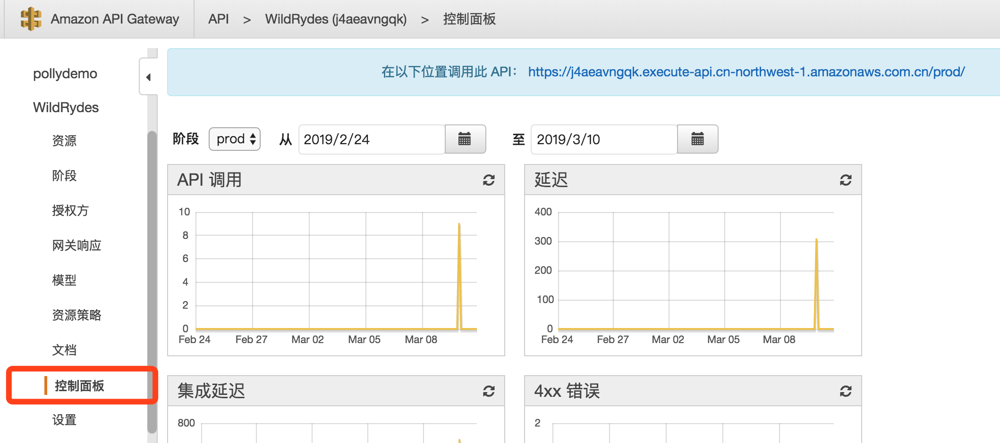   
打开 CloudWatch 进行 API 监控，可以更细致的查看不同请求方法不同资源（例如 POST，GET）的指标  
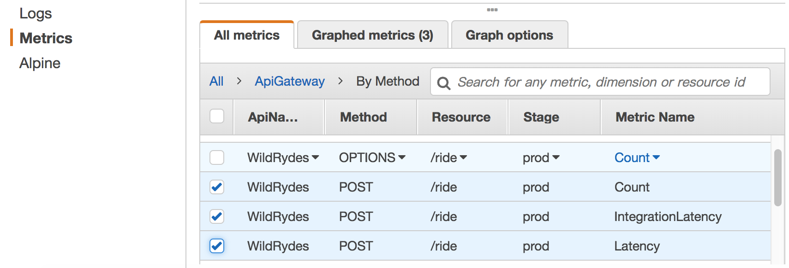  

7. API 部署倒回  
版本发布后如果需要倒回旧版本，可以选择部署倒回到对应时间的发布。
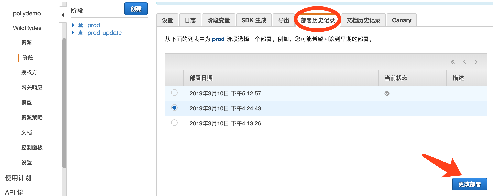  

8. API 金丝雀发布（灰度发布）  
在API Gateway对应的阶段，点击 Canary 金丝雀，点创建
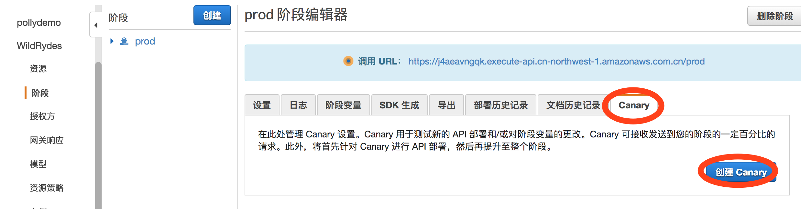 
创建金丝雀并设置百分比之后，后续部署到这个阶段(例如 prod)的版本，并不会立刻提供给所有用户访问，而只是5%的用户能访问到最新版本。
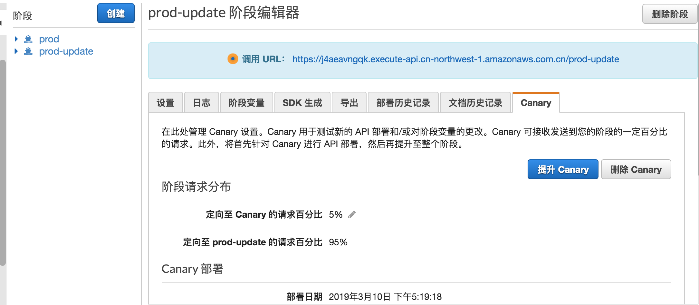 
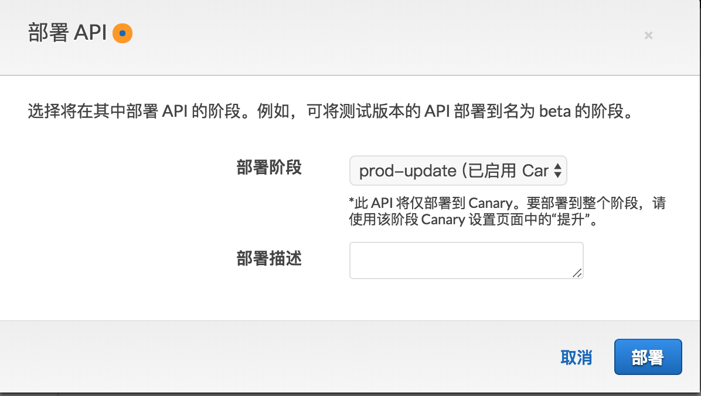 

版本验证可以完全发布之后，可以点击“提升 Canary“，以使新版本成为正常生产环境，接受100%的请求流量。