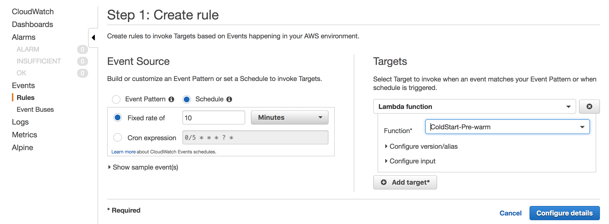
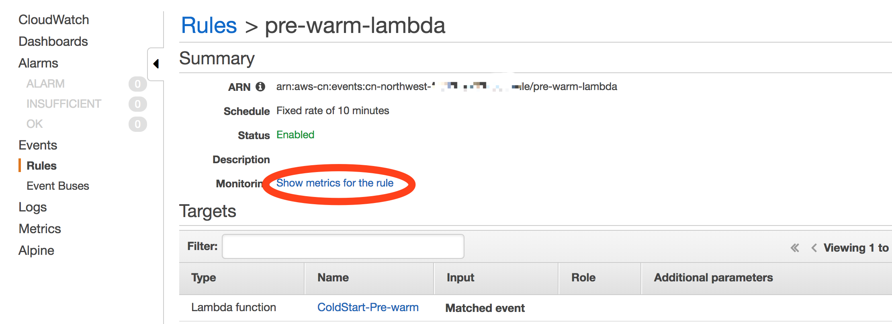

# AWS Lambda 预热
This is a sample code of how to migitate Lambda cold start by leverage pre-warm.  
对于 Lambda 冷启动时间比较长的场景，例如 Lambda 运行在 VPC 中，因为冷启动的时候需要附加一个 ENI，所以启动时间会长。另外 Java 和 C# 语言本身启动时间也会相对长些。需要考虑进行定时预热，即每个一段时间用一个 CloudWatch 定时任务触发一个预热用的 Lambda ，由这个 Lambda 去调用被预热的 Lambda。对于在 VPC 中的场景，预热周期建议设置15分钟，非 VPC 的Lambda，预热建议设置5分钟一次。    
说明：
* 冷启动不是必然遇到的，即使上面说的 VPC 的情况，只要业务是正常运行被访问的，通常99%的请求是不会遇到冷启动的。
  

## 预热 Lambda 函数

创建一个名为“ColdStart-Pre-warm”的Lambda函数。  
以下为以 Node.JS 编写的预热 Lambda 示例，其中 function_name 为被预热Lambda的名称，concurrent_num 是预热的并发数量（NodeJS是非阻塞的）。调用方式设置为“Event“，即异步调用，提高调用效率。    
* 该 Lambda 的执行角色需要有 Invoke 其他Lambda（被预热Lambda）的权限，否则会执行失败。  
* 根据并发数量，适当增大运行内存以便有更多CPU资源执行并发session，例如 512M，适当增大执行超时时间，例如 1分钟。  
* 建议在调用的 Payload 中设置一个标识符，以便被预热的Lambda在收到这个标识符的时候，可以识别到这个是一个预热任务，从而跳过后面的业务逻辑。
* 建议被调用的函数，在识别到是预热调用后，执行一个延迟（几十毫秒 - 几百毫秒）然后直接结束函数，例如 python 的 time.sleep，或者 nodejs 的 setTimeout , Java 的 Thread.sleep 等。这样的作用是避免被预热函数太快结束，并迅速又被另一次预热调用，达不到足够的并发的目标。

代码如下：

    'use strict';

    const AWS = require('aws-sdk');
    const lambda = new AWS.Lambda();
    const function_name = 'Lambda_worker';
    const concurrent_num = 100;
    var params = {
        FunctionName: function_name, 
        InvocationType: "Event",
        Payload: "{}" //建议设置一个标识符识别是预热调用
        };
        
    exports.handler = (event) => {
        for(var i = 1; i <= concurrent_num; i++) {
            lambda.invoke(params, function(err, data) {
                if (err) console.log(err, err.stack); // an error occurred
                else     console.log(data.Payload);           // successful response
            });
        }
        return 'invoked';
    };
  

注：对于生产级大规模的项目，pre-warm的比较工程化的代码实现请参考  
https://github.com/jeremydaly/lambda-warmer  

## 设置 CloudWatch 定时任务
在 CloudWatch 中创建一个定时任务，定时触发预热 Lambda 函数，触发目标选择 Lambda 以及选择对应的预热函数。

建了定时任务之后，可以查看到定时任务执行的情况，点击此连接会跳转到 CloudWatch 对应的指标  

监控示例：
