# 通过 AWS LAMBDA 发送微信公众号推送

随着微信公众平台发展，越来越多的商户选择使用微信公众号向客户发送一些重要的通知，例如商品购买通知，订单状态异常通知，信用卡刷卡通知等。
本文主要根据以上场景，使用AWS Serverless （无服务器）架构实现微信通知。
对于开发者来说，无需烦恼底层服务器的构建和运维。Serverless架构会随着需要发送的通知数量进行自适应的扩展，实现实时通知发送。

在本lab中，您将学习如何通过 [**LAMBDA**](https://www.amazonaws.cn/lambda/) 以及 [**SNS**](https://www.amazonaws.cn/sns/?nc2=h_l3_ms) 快速实现此套系统。


## 整体架构
本文介绍的消息通知系统使用目前流行的无服务器架构，实现步骤如下：
1. 把需要通知的内容发送到 AWS SNS      
1. 然后通过 AWS Lambda 订阅 SNS 中的内容，实现简明的业务逻辑   
1. 使用 AWS Lambda 调用微信公众平台 API，把消息发到指定客户的微信   


## 准备工作
1. 点击 [下载代码(sns2wechat.zip)](code/sns2wechat.zip)  
1. 进入微信的 [微信测试号](https://mp.weixin.qq.com/debug/cgi-bin/sandbox?t=sandbox/login) 后，使用个人微信号扫一扫确认就可以获取一个测试账号了，这个测试账号具有需要用到的微信高级接口权限。
1. 扫码登陆后，复制页面的“appID”和 “appsecret” （相当于开发者身份密钥）
   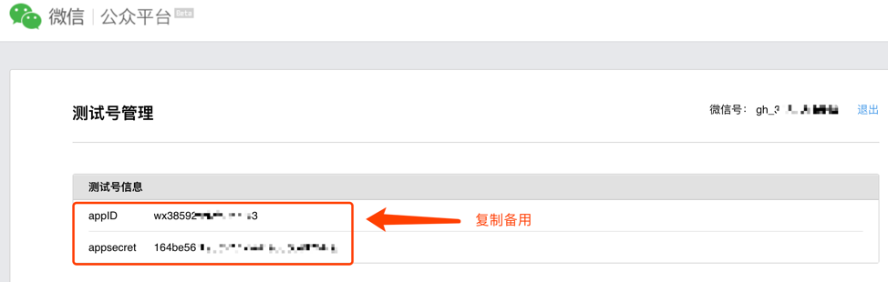
1. 打开自己的个人微信，关注自己的测试公众号。并记录自己微信号（openid），复制备用
   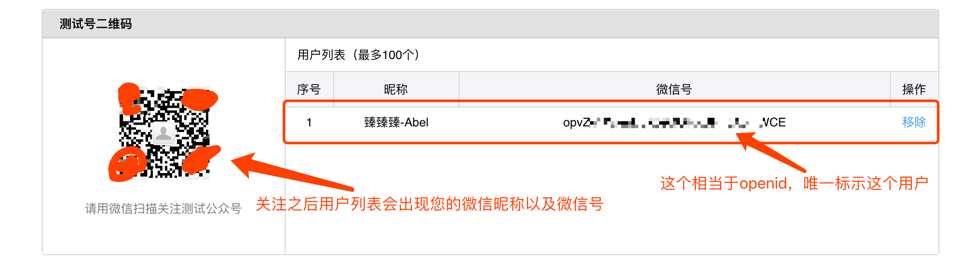
1. 创建消息模版，这里已经为大家准备好了模版
   ```
   {{first.DATA}} 
   商品明细 
   名称: {{keyword1.DATA}} 
   价格:{{keyword2.DATA}}  
   交易时间:{{keyword3.DATA}} 
   {{remark.DATA}}
   ```
   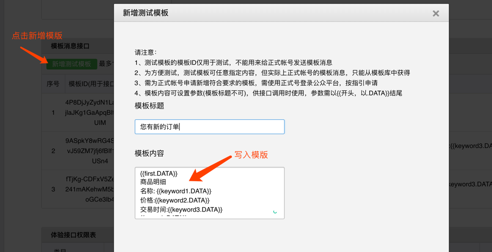
   
1. 复制您的模版id
   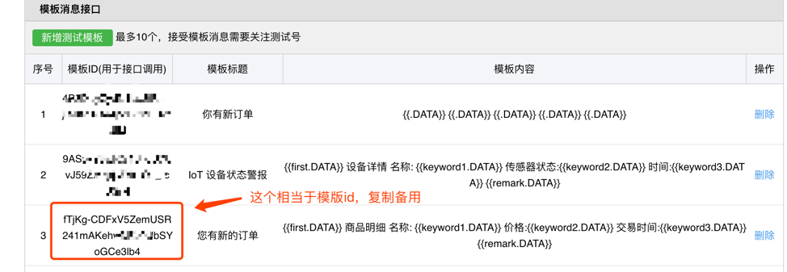
   
1. 到这里为止您已经配置好了微信端，此时您应该已经有以下参数格式类似如下。请替换成您的参数，备用。
   ```
   appid = ‘xxxxxxxxx’
   appsecret = ‘xxxxxxxxxxxxxxxxxx’
   openid = ‘xxxxxxxxxxxxxx’
   templateId = ‘xxxxxxxxxxxxxx’
   ```
   
## 创建AWS资源   
1. 创建 lambda, 选择 Nodejs6.10 
   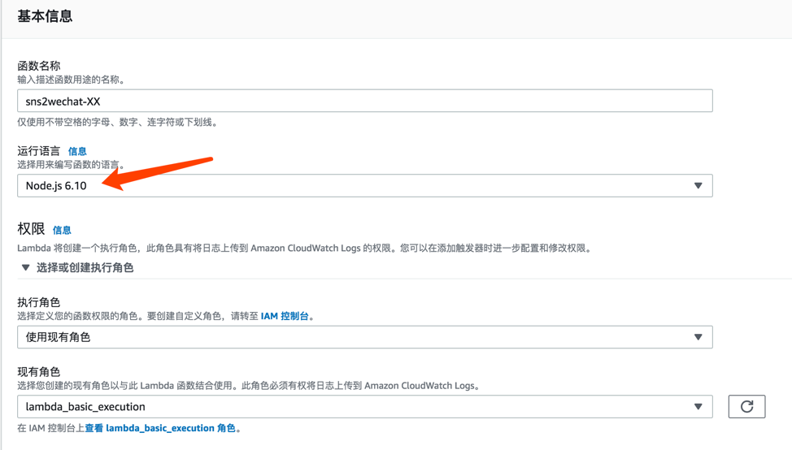
   
1. 上传部署 lambda
   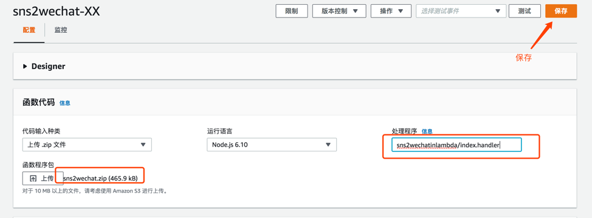
   
1. 修改代码，替换您的 appid 以及 appsecret   
   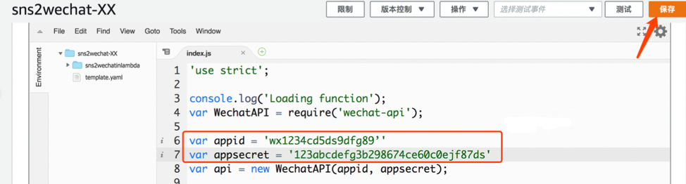

1. 打开 [SNS](https://console.amazonaws.cn/sns/v2/home?region=cn-north-1#/home)，创建主题
   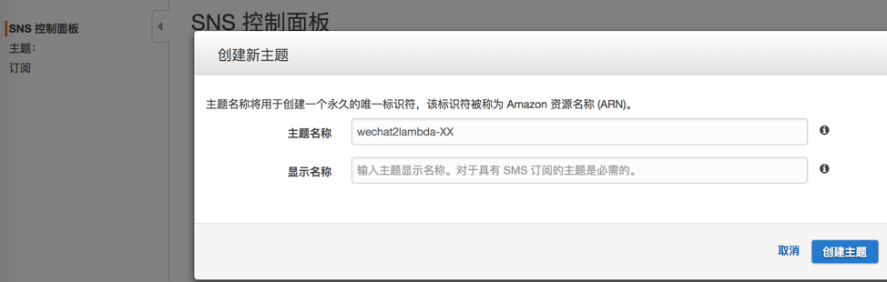

1. 点击创建订阅，选择刚刚创建的 lambda
   

   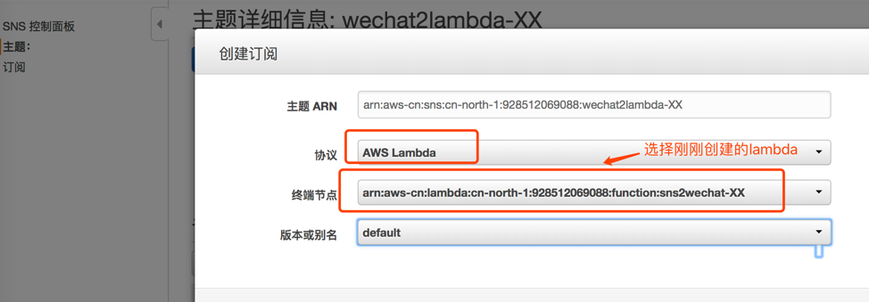

## 发送微信消息通知   
1. 点击 **发布到主题**
   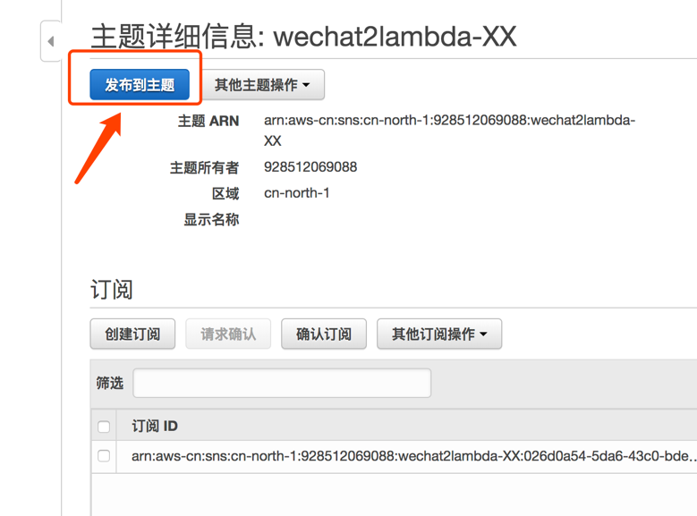

1. 您可以在消息处选择发送以下内容
   ```
   {
      "templateId": "7BCdeF9hIJ0Kl-aB6KvJ59ZM7jfj6fBIf1OL_-dDFb6", 
      "url": "z.cn",
      "openid":"opDi3TmaFiF98ABCDEF_9M9nHJK",
      "first":"跨境交易提醒!",
      "keyword1":"海淘...",
      "keyword2":"$100.00",
      "keyword3":"2019年03月18日",
      "remark":"点击查看详情"
   }
   ```
   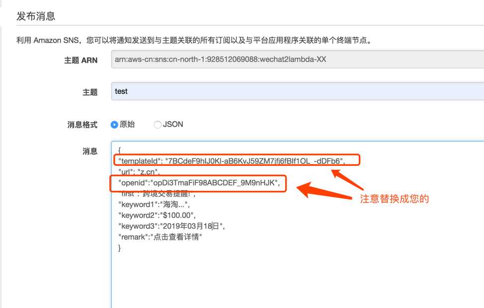
   
1. 点击发送后您可以在微信中看到如下提醒，您可以尝试点击，会跳转到对应的超链接，其实就是在 SNS 发送的 JSON 里面自定义内容了。
   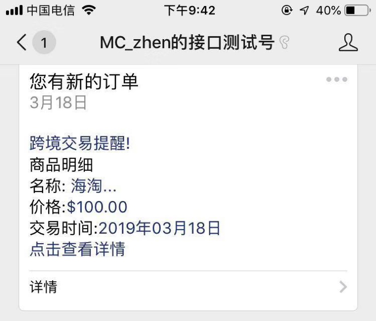


## 总结
在本文中主要简述了使用 SNS + Lambda 方式发送微信通知，在生产系统中，我们可以通过把不同系统产生的通知消息发送到SNS，然后由 lambda 自动化处理消息通知。整套架构用到的服务都会按次触发，既降低运维难度又节约成本。

下面可以点击此处 [回到主目录](README.md) 回顾总结或者进行其他实验。

## 参考资料
[AWS官方博客：轻松使用 Serverless 架构实现微信公众号后台开发](https://aws.amazon.com/cn/blogs/china/easytouse-serverless-wechat-official-account-development/)    
[GitHub Wechat API](https://github.com/node-webot/wechat-api)     
[带您玩转Lambda，轻松构建Serverless后台！](https://aws.amazon.com/cn/blogs/china/lambda-serverless/)     
  
--------
整理 by Li, Tiange; Xie, Baizhen