# Serverless CI/CD pipeline With Code Series

本文利用 AWS Code 系列（**codepipeline**，**codecommit**, **codebuild**, **codedeploy**）实现 Serverless 的 CI/CD 工作流。

## 基础知识

- 持续集成( Continuous Integration,简称CI ) 是指在应用代码的新组件集成到共享存储库之后自动测试和构建软件的流程。这样一来，就可以打造出始终处于工作状态的应用“版本”。

- 持续交付( Continuous Deployment, 简称CD )是指将CI流程中创建的应用交付到类似生产环境的过程，在该过程中将对应用进行额外的自动化测试，以确保应用在部署到生产环境以及交付到真实用户手中时能够发挥预期作用


## 架构综述
在这个 lab 中， 我们会使用 codePipeline 控制整个 **CI/CD** 流程。  
开发人员把写好的 Lambda 代码 push 到 codeCommit，一旦检测到有新的代码，codeCommit 就会自动触发 codeBuild 进行 CI 操作，持续集成操作主要依赖 codeBuild 完成。  
值得一提的是，codeBuild 既可以选择已有的镜像环境(基于 Amazon Linux 或者 Ubuntu )，也可以自定义镜像。  
本文中，额外使用了自定义的 docker 镜像，存储在 ECR 当中，作为 codeBuild 的构建环境。自定义镜像自定义 CI 需要的环境，例如预先安装好NodeJS，Serverless Framework, Mocha 测试框架，Jfrog Artifictory 远程依赖库地址等。当然除了 npm 之外，还可以自定义 maven 的远程依赖库地址。  
我们还会增设审核步骤，设置 **SNS** 在 **codeBuild** 完成后自动发送审批邮件，审核人员可以邮件查看测试报告，根据结果决定是否放行下一步部署。  
审核通过放行后，由 codeDeploy 完成 lambda 新版本的流量转移。  
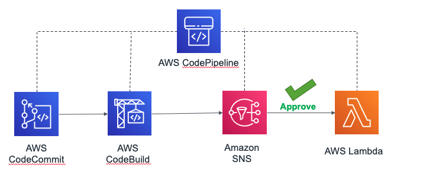


## 前提条件

- 由于中国区暂未引进 pipeline，此 lab 内容基于 **Global区账号** 。请提前到 [此页面](https://aws.amazon.com/cn/)注册海外区账号。

- 本文是基于新加坡 region 完成的，您也可以自行选择其他区域，记得替换配置文件里面的 [region-code](https://docs.aws.amazon.com/AWSEC2/latest/UserGuide/using-regions-availability-zones.html#concepts-available-regions)

## 具体步骤

## 步骤一：构建自定义的 codebuild 环境(optional)
> 如果不需要自定义环境，跳过此步。

Codebuild 本来就有自己的代码环境，例如 python，Java 这些。但有时还是不满足需求, 这种情况可以构建自定义的 build 环境，用 **ECR** 做镜像存储。

1. 点击下载 [codebuild官方镜像文件](https://github.com/aws/aws-codebuild-docker-images/tree/master/ubuntu/standard/2.0)，并根据需要修改 [Dockerfile](https://github.com/aws/aws-codebuild-docker-images/blob/master/ubuntu/standard/2.0/Dockerfile)，如预装软件，配置 credentials 等。

1. 在完成自定义后，将镜像传到自己的 ECR repo 下。点击跳转 ECR 控制台 并新建一个 repo。

1. 镜像上传大概可以分为 **登录**，**生成镜像**，**标记镜像**，**推送镜像** 四个步骤。具体命令可以在 ECR 控制台 - 仓库 - 镜像查看。


   1. 登录：```aws ecr get-login --no-include-email --region <your-region-code>```

   1. 生成自定义 Docker 镜像：修改 serverless-cicd 文件夹下的 **Dockerfile** 文件，删除或者剪裁不需要的环境。修改完之后用 build 命令生成 image。示例命令如下。等待镜像上传。对于比较大的镜像，等待时间可能比较长。   
      ```
       docker build -t serverless-cicd .
      ```         
      
   1. 标记镜像：```docker tag```

   1. 推送镜像：使用```docker push```命令把 image 打包上传到 [ECR](https://www.amazonaws.cn/en/ecr/)。
  
   1. 推送成功后，页面应该如下图所示：
     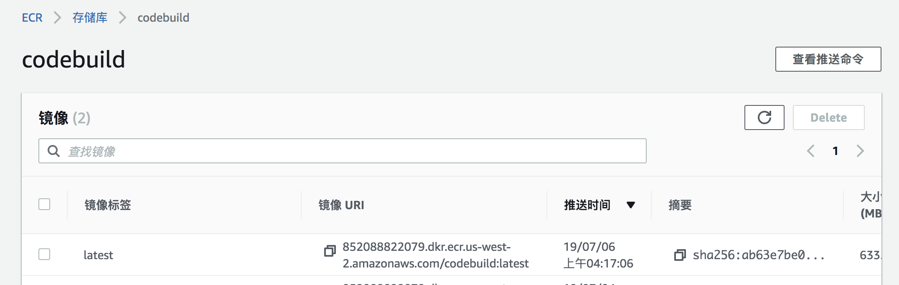
  
  
### 步骤二： 把代码上传到 codecommit

与 GitHub 的使用流程大致相同。对于 codecommit 不熟悉的同学可以参考 [CodeCommit入门教程](https://docs.aws.amazon.com/zh_cn/codecommit/latest/userguide/getting-started-cc.html) 查看详细教程。

1. 先按照 Connection Steps 里面的教程，创建凭证用于 HTTPS 或者 SSH 登录。
   
   
1. 下载 sample code，sample code 包含三个文件，说明如下。在上传之前，请确保已经替换相关参数，否则会 build 失败。

   - [lambda_function.py](code/lambda_function.py) 为 lambda 基于 python 2.7 的程序代码，sample code 中为基本的 hello word，可自定义代码。
   
   - [buildspec.yml](code/buildspec.yml) 为 codebuild 所需要的 yaml 配置文件，我们将利用此文件将新版本代码部署成一个新version，输出用于 codedeploy 的配置文件 appspec.yaml 放到 S3 bucket 当中。需要替换文件中的 **lambda function name, region code** 等信息。
   
   - [appspec.template.yaml](code/appspec.template.yaml) 为 codedeploy 所需要的配置文件模板，我们将利用此模板生成自己的 appsepc.yaml 文件。**需要替换 demo 为自己的 Lambda 函数名**， **alias替换为自己的 版本号别名** 。
   
1. 将自定义代码上传至 codeCommit，上传后如图所示。
   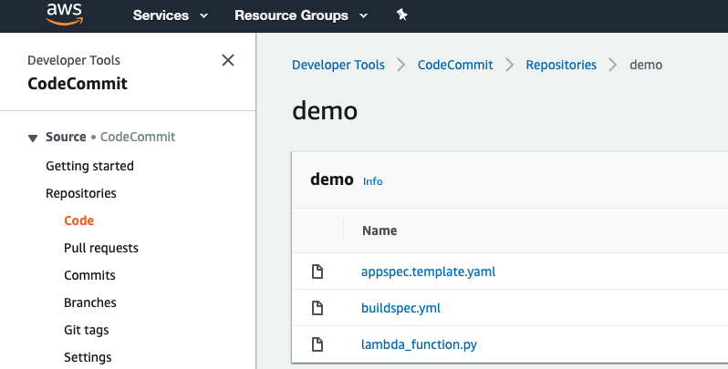
   
### 步骤三： 构建 Codebuild

创建 build 环境。

1. 创建一个 codeBuild，源选择在第二步创建的 codeCommit
  

1. 配置构建环境
   - 如果没有自定义镜像，请选择托管镜像
     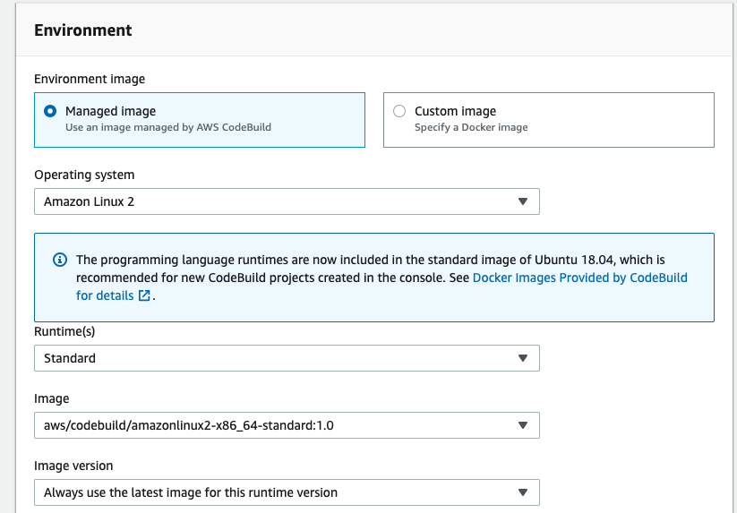
     
   - 如果自定义了镜像环境，选择使用我们在第一步发布好的ECR image环境。
     

1. 其他使用默认选项，点击创建即可
  

### 步骤四：构建 pipeline 构建 CI 流程

本小节将创建从 codeCommit 到 codeBuild 的 CI 过程。

1. 打开同一个区域的 codepipeline，创建一个新的 pipeline
  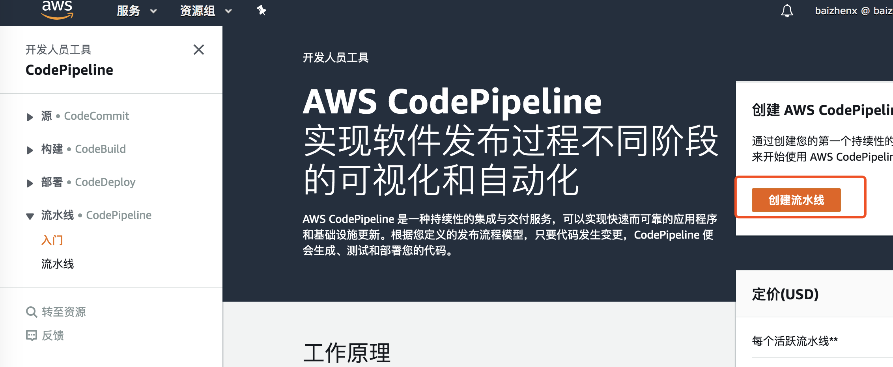
  
1. 自定义名称，下一步
  

1. 设置代码源
  
  
1. 选择上一步创建的Codebuild
  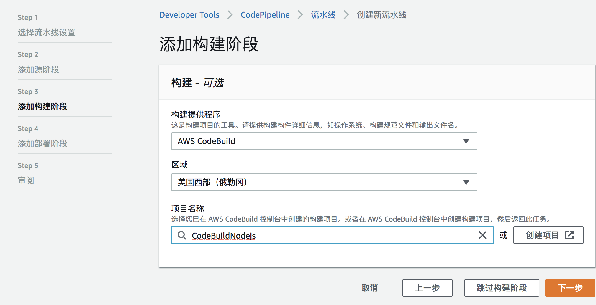
  
1. 此步中，由于我们还没有部署 codedeploy，先不需要部署配置，点击 **跳过部署**，完成。

1. 此时通过 codecommit 每次 commit 新的代码，将自动触发 codeBuild，生成 appspec.yaml 文件到 S3 中。pipeline 效果截图如下。可以通过提交新的代码到 codecommit 测试
  

### 步骤五：为 pipeline 添加 CD 流程

本小节基于步骤四：CI， 进一步为 pipeline 添加 CD 流程，实现从 codeCommit 代码上传到 codebuild 自动编译测试生成新版本，到 codedeploy 自动部署的流程。

1. 新建 lambda function。python2.7，比如起名为 codedeploy。点击获取 [用于pipeline的python代码](code/deploy4lambda.py)，自定义 [deployConfiguration](https://docs.aws.amazon.com/AWSCloudFormation/latest/UserGuide/aws-resource-codedeploy-deploymentgroup.html)，也即流量转移策略。

1. 选择已经配置好的 pipeline 进入配置页面，点击右上角编辑按钮，添加新的 stage

1. Add new group, 配置如下。
   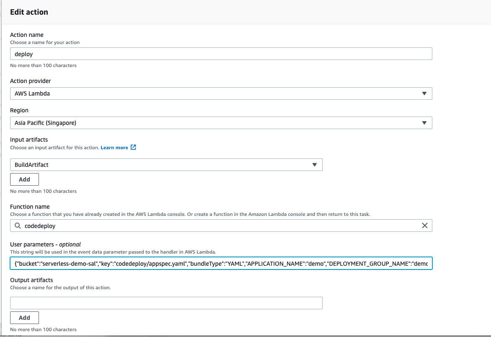
   
    Codepipeline 传入的变量示例如下。请替换成自己的 bucket，key，application_name 以及 deployment_group_name  
    ```
      {
        "bucket":"xxxxxx",         # 替换为自己的S3 Bucket name
        "key":"codedeploy/appspec.yaml",   # 注意更换appspec.yaml在S3中的文件位置路径
        "bundleType":"YAML",
        "APPLICATION_NAME":"serverless-cicd",      # application name
        "DEPLOYMENT_GROUP_NAME":"serverless-cicd"  # deployment_name
      }
    ```

1. 此时，codecommit-codebuild-codedeploy 的 pipeline 已经创建完毕，提交新代码到 codecommit 测试，比如我们可以在 hello word 中修改 print 的 log 内容。在 pipeline 流程显示成功后，点击 lambda 可以看到新版本已经部署成功。

### 步骤六：为 pipeline 添加审阅后自动部署功能 

在本节中，我们会添加 codeDeploy 审阅和部署功能。在审核人完成审核通过后，codepipeline 自动完成部署。
在 deploy 之前 add stage，manual approval

1. 配置SNS。新建一个topic并且 **创建订阅**。

1. 添加 Manual Approve 环节
  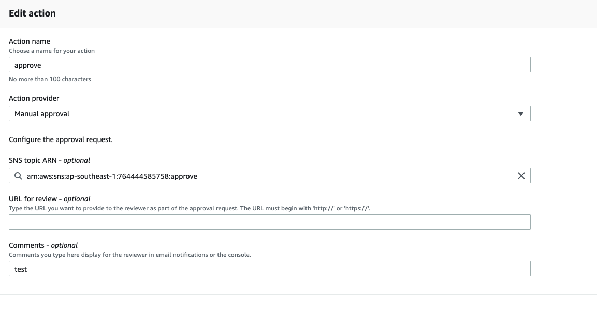

1. 这样，每当有新的 commit 的时候，会发邮件到 reviewer 的邮箱，reviewer 可以登录控制台点击查看最新 commit 的内容，只有当 reviewer approve 这次 commit 后，代码才会完成部署。留意，需要给 reviewer 的 AWS IAM User 足够的权限，使得他有权查看 commit 内容并进行审批。

1. 最终效果
  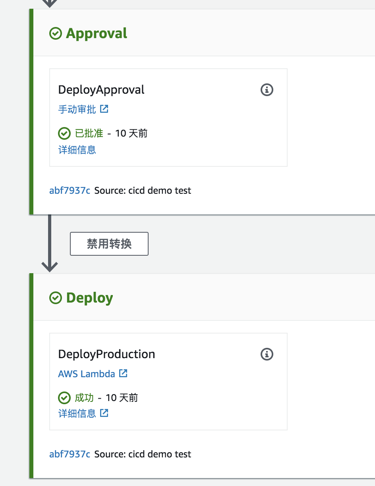

### 监控 & 错误排查

Code 系列均有详细的 log 可以供您去做错误排查。

1. CodeCommit
   跟 github 的使用方法类似，如果出现错误，可以根据 console 信息去排查。常见错误有权限不够等。

1. CodeBuild 错误排查
   可以在控制台查看到所有的 build 历史
   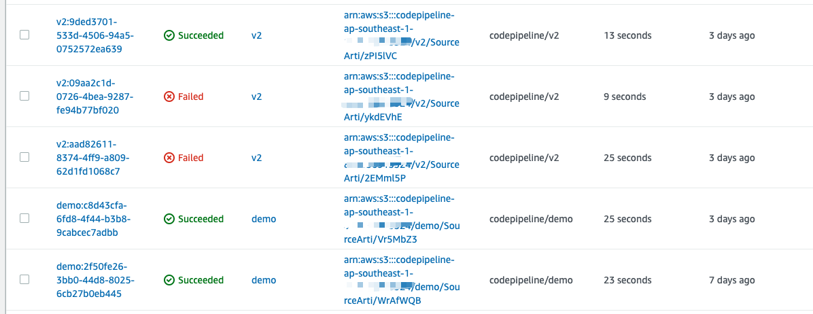
 
   如果 codebuild 某个任务失败，点击进入查看特定任务，可以获取所有 log，轻松排查出错原因。
   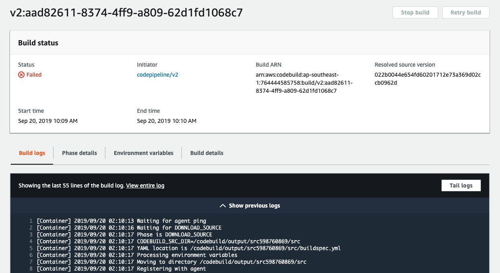
   
   
   修改错误后，成功信息如下：
   

1. CodeDeploy 错误排查
   如果 codedeploy 失败，也可以获取到具体日志。
   
   
   点击该任务，会有错误信息。比如此错误信息告诉我们 AppSpec 文件不存在或者配置错误。
   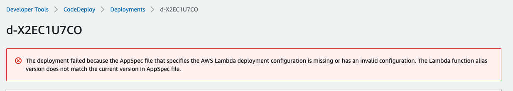

   在修改错误后，成功信息如下。
   
   
### 总结
本文探讨了基于 serverless 场景下的 CICD 的实现。我们通过 pipeline 可以方便的管理整套 CICD 的流程，实现从代码的提交，到自动编译，到实现 lambda 新版本的发布以及安全的流量转移部署。
  
--------
整理 by Li, Tiange; Xie, Baizhen