# 在中国区配合 Jenkins 和 CodeDeploy 实现 Lambda 的自动化发布与部署

本文使用 Jenkins 结合 CodeBuild，CodeDeploy 实现 Serverless 的 CI/CD 工作流，用于自动化发布已经部署 lambda 函数。
在 AWS 海外区，CI/CD 工作流可以用 codepipeline 这项产品来方便的实现，由于中国区暂时未发布此款产品，此文采用 [Jenkins](https://jenkins.io/zh/) 做替代方案管理 CICD 工作流。

本文具体包含两个实验，第一个实验为 Jenkins + CodeDeploy + lambada，第二个实验在这个环节中加入 CodeBuild。
利用这两个实验，我们可以演示 Jenkins 与 AWS Code 系列的配合。两个实验所涵盖的所有产品在中国区都可以使用。

## CICD 基本概念   
- 持续集成( Continuous Integration,简称CI ) 是指在应用代码的新组件集成到共享存储库之后自动测试和构建软件的流程。这样一来，就可以打造出始终处于工作状态的应用“版本”。
- 持续交付( Continuous Deployment, 简称CD )是指将CI流程中创建的应用交付到类似生产环境的过程，在该过程中将对应用进行额外的自动化测试，以确保应用在部署到生产环境以及交付到真实用户手中时能够发挥预期作用。

## 架构综述   
在此 lab 中，开发人员把写好的 lambda 代码 push 到自己的 Github 中，每当有新的 commit，将自动触发 Jenkins CICD 工作流，Jenkin 会利用 CodeBuild/CodeDeploy 自动部署发布 lambda 新版本。
另外，在本文的最后，我们还将学会如何上传自定义镜像到 codeBuild。     
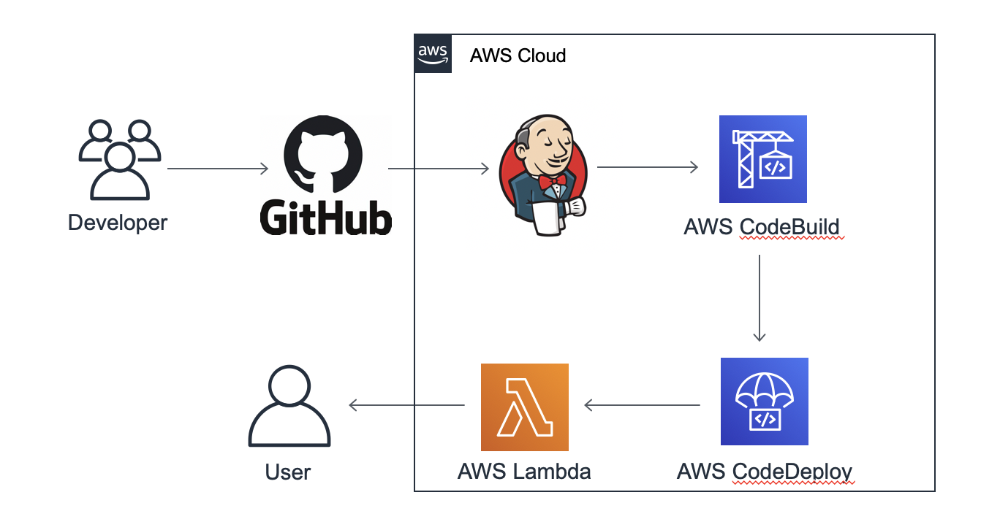

## 前提条件   
- 本文基于 AWS China 北京区 (**cn-north-1**), 如果您希望在宁夏区，请自行替换代码中所有 region code 为 **cn-northwest-1** 。
- 请先启动一台 EC2 Linux Server 作为 jenkins server。**确保此 EC2 的安全组允许 22 端口与 8080 端口开放**。
- 本文基于 Amazon Linux 2 AMI 安装，```java -version``` 为 ```openjdk version "1.8.0_201"```

## 实验步骤   

## Jenkins Server 的搭建与配置   
0. 配置权限 
   登录到 EC2 实例中，执行以下命令
   
   ```
   # 如果使用 Amazon linux 系统，AWSCLI 已经自动安装；如果没有，则需要运行下列命令手动安装 AWSCLI
   #  pip install awscli
   aws configure 
   # 配置 AWS AKSK credentials
   ```
   
   有关于从哪里获取 AKSK 相应信息，请参考[管理访问秘钥](https://docs.aws.amazon.com/zh_cn/IAM/latest/UserGuide/id_credentials_access-keys.html#Using_CreateAccessKey)
   此 AKSK 至少应当有更新、部署 lambda 函数, s3 基本权限, codebuild，CodeDeploy 等权限。
   
1. 安装 Jenkins      

   ```
   sudo yum install java  #安装java
   # 此为官方镜像
   sudo wget -O /etc/yum.repos.d/jenkins.repo https://pkg.jenkins.io/redhat-stable/jenkins.repo
   sudo rpm --import https://pkg.jenkins.io/redhat-stable/jenkins.io.key
   sudo yum install jenkins
   sudo chkconfig jenkins on
   sudo service jenkins start
   ``` 
   
   查看 Jenkins 初始密码
   ```
   sudo cat /var/lib/jenkins/secrets/initialAdminPassword
   ```   
   
1. 登录 Jenkins   
   在浏览器输入输入EC2的公网IP地址（如果想保持此实例 ip 固定，请提前绑定一个 [弹性EIP](https://docs.aws.amazon.com/zh_cn/AWSEC2/latest/UserGuide/elastic-ip-addresses-eip.html) 固定 ip），比如3.213.113.xx:8080，然后出现如下界面，输入上面得到的 Jeknins 默认密码。   
   

   选择 **安装推荐插件**    
   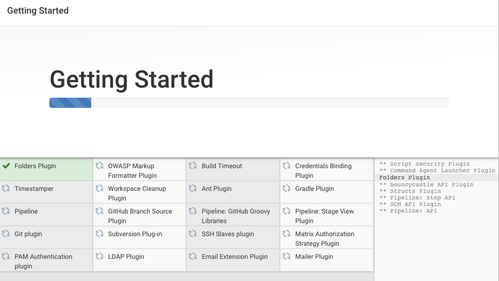

   配置用户     
   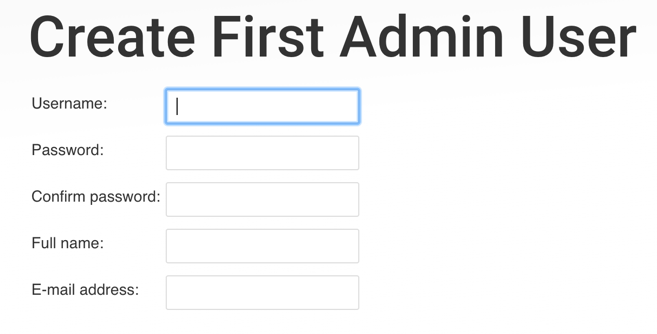

   Jenkins setup 完成    
   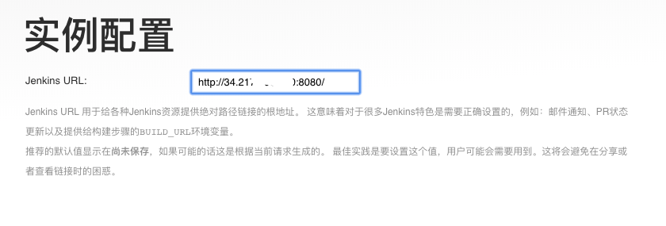
   
   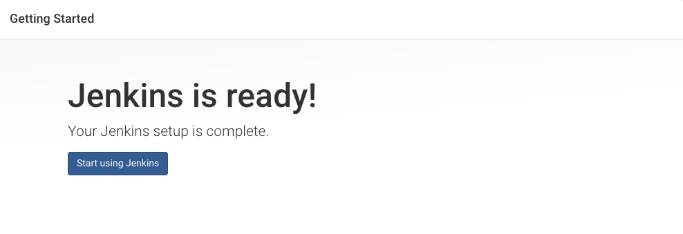

1. 为 Github 添加 Webhooks

   进入自己的 Github 地址，在 setting - developer setting 当中，新生成一个 GitHub token，用于 Jenkins 访问 GitHub。记录下生成的token字符串，比如： bf6adc27311a39ad0b5c9a63xxxxxxxxxxxxxx 用于后续配置。   
   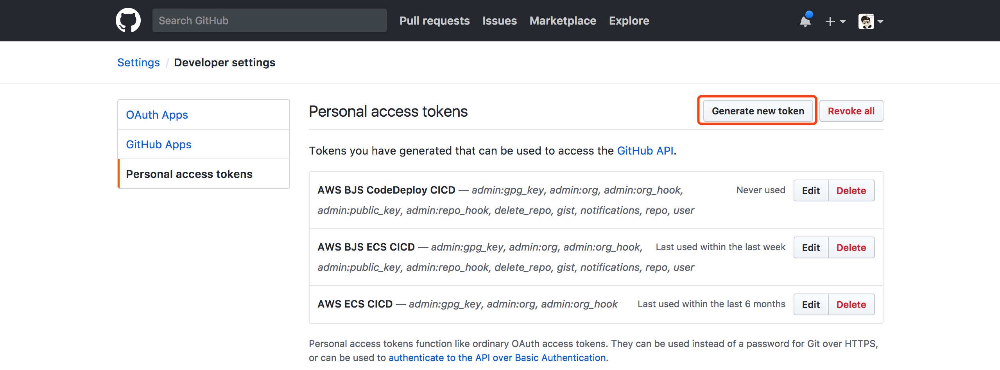

   Payload URL设置Jenkins Server的地址（如 3.213.113.xx:8080）。   

   创建或者选择一个 public repository，**用于放置用于后续 lambda 函数部署的源码**，点击 Settings 配置 **webhooks** ，使得此 repo 可以后续自动触发 Jenkins的 CICD 流程    
   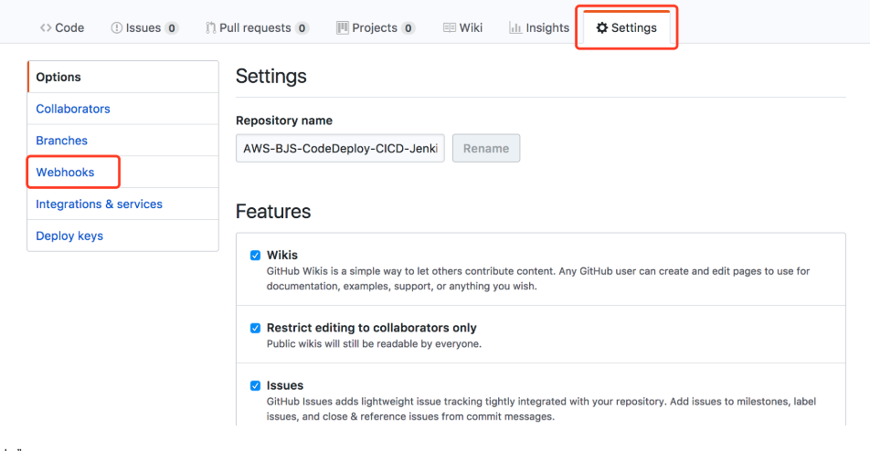

   右侧点击 **add webhook**
   
   在Payload URL，输入 ```http://EC2公网IP地址/github-wekhook/```    
   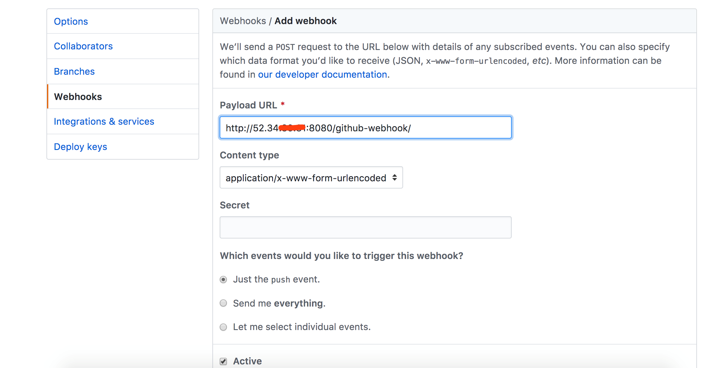

1. Jenkins 配置

   进入系统配置      
   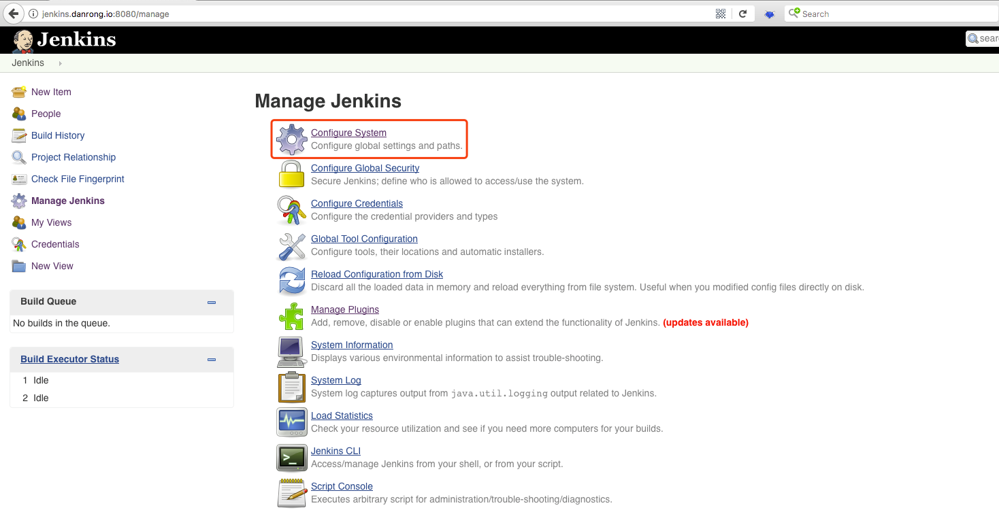   

   添加权限     
   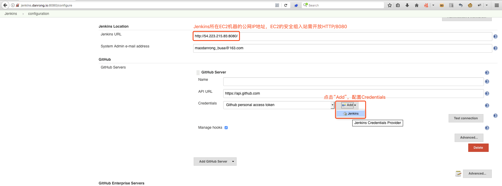

   选择类型为 **secret text**， 输入刚才从 Github 生成的 Access Token，点击“添加”。     
   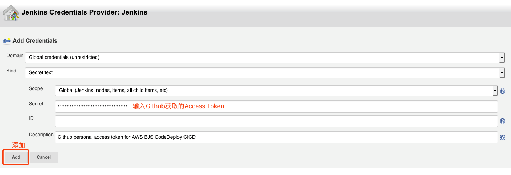

   点击 **test connection** 测试链接，没有报错说明配置成功。     
   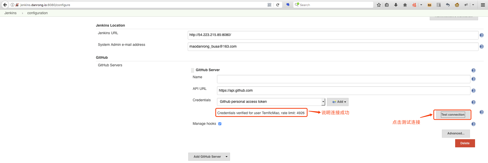

1. 代码管理     
   在配置了 webhook 的 github repo 中，上传以下文件。
   - **lambda_function.py** ：用于 target lambda 函数
   - **[appspec.template.yaml](https://github.com/aws-samples/aws-serverless-workshop-greater-china-region/blob/master/Lab8-CICD/code/appspec.template.yaml)** ：用于 codedeploy 配置文件。
   请将此文件当中的函数名以及 alias（别名）替换为自己对应的值。


## 实验一： Jenkins with CodeDeploy 实现 lambda 的自动更新

### 步骤一：新建 lambda 函数
新建基于 python 的 lambda 函数。此 lambda 函数为我们的目标 lambda 函数，在本实验完成后，每当有新的 commit，都会触发此 lambda 函数进行自动化部署。
如您不清楚步骤，请参考[创建您的第一个 Lambda 函数](https://github.com/aws-samples/aws-serverless-workshop-greater-china-region/blob/master/Others_Beginner_Labs/lab1.md) 
此文重在搭建 CICD 流水线，代码直接用默认生成的 hello word 代码。

publish 此 lambda，版本为1，并且创建别名（alias）。

### 步骤二：配置 CodeDeploy
如您希望了解 CodeDeploy 的概念，请参考[AWS CodeDeploy 快速入门](https://aws.amazon.com/cn/blogs/china/getting-started-with-codedeploy/)。以下为具体操作步骤。

先创建一个角色(role) 供 codedeploy 使用，使 codedeploy 有更新 lambda 的权限。

新建一个 codeDeploy 应用，选择 lambda 平台，命名为如 ``first-try-with-jenkins``    
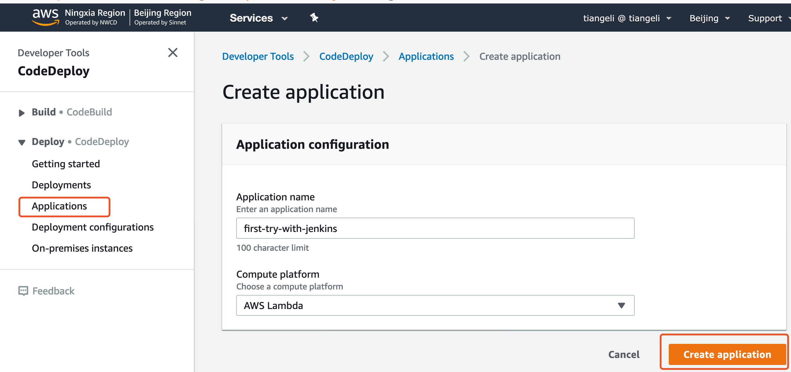

点击刚刚创建的应用，新建一个 deployment group，同样命名为``first-try-with-jenkins``.    
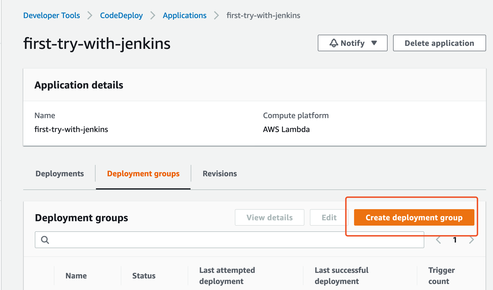

service role 选择刚才创建的 codedeploy 的 role。部署策略，此文以 all at once（全部切换）为例，也可以根据需要选择其他的线性或者金丝雀的部署策略。   
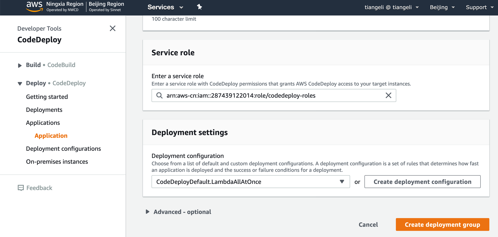

下一步我们创建一个 Jenkin 的项目，配置 codedeploy 相应信息。

### 步骤三：新建 Jenkins 项目

新建一Jenkins个项目，点击“Create a new project” -- "freestyle project"
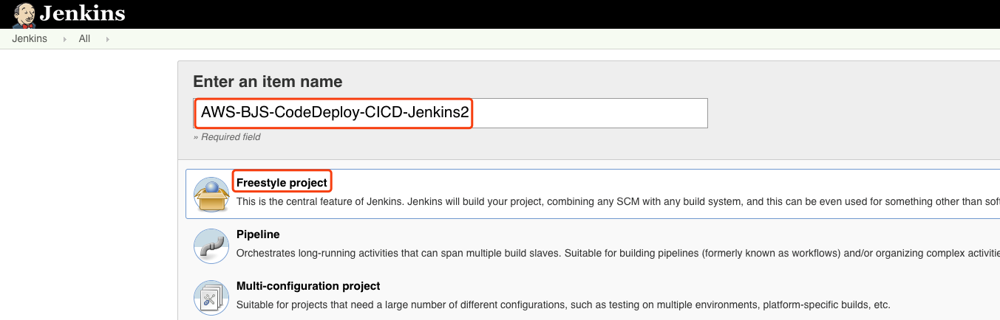

配置Github项目的地址，源代码管理选择Git方式。
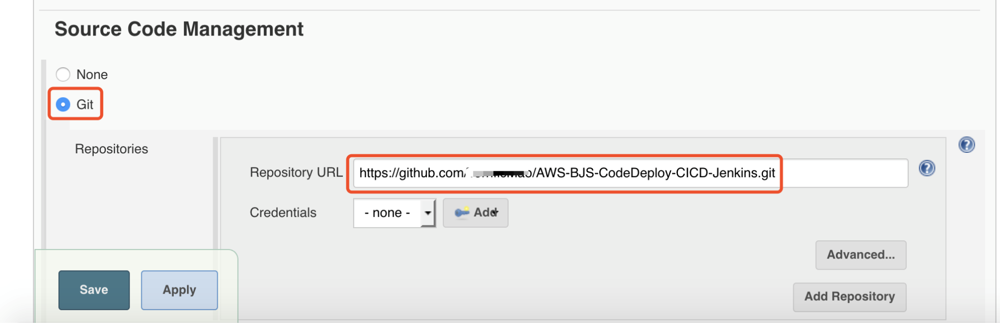

触发构建，选择 Github hook trigger for GITScm polling
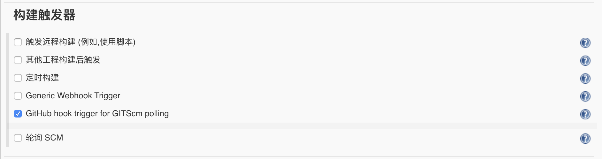

添加构建步骤，新增 shell ，请自定替换所有尖括号括起来的参数
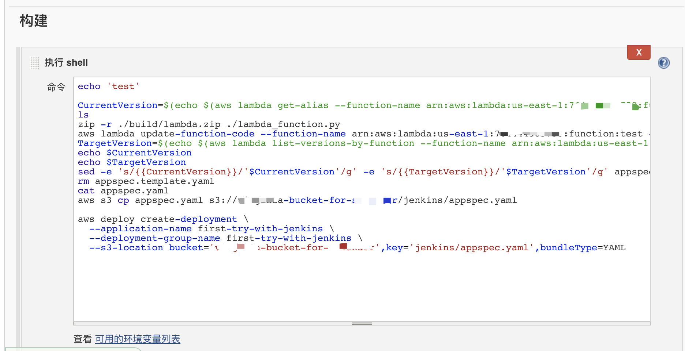

```
CurrentVersion=$(echo $(aws lambda get-alias --function-name <lambda函数ARN> --name beta --region cn-north-1 | grep FunctionVersion | tail -1 |tr -cd "[0-9]"))
mkdir build
zip -r ./build/lambda.zip ./lambda_function.py
aws lambda update-function-code --function-name <lambda函数ARN> --zip-file fileb://build/lambda.zip  --region cn-north-1 --publish
TargetVersion=$(echo $(aws lambda list-versions-by-function --function-name <lambda函数ARN> --region cn-north-1 | grep Version | tail -1 | tr -cd "[0-9]"))
echo $CurrentVersion
echo $TargetVersion
sed -e 's/{{CurrentVersion}}/'$CurrentVersion'/g' -e 's/{{TargetVersion}}/'$TargetVersion'/g' appspec.template.yaml > appspec.yaml
rm appspec.template.yaml
cat appspec.yaml
aws s3 cp appspec.yaml s3://<S3-bucket-name>/jenkins/appspec.yaml

# 将 first-try-with-jenkins 替换为自己的 codedeploy application name 和 deployment group。
aws deploy create-deployment \
  --application-name first-try-with-jenkins \
  --deployment-group-name first-try-with-jenkins \
  --s3-location bucket='<S3-bucket-name>',key='jenkins/appspec.yaml',bundleType=YAML

```

### 步骤四：测试效果

在本地修改代码，通过``git commit``, ``git push`` 提交代码更新到 github repo 中，此时 codedeploy 会自动被触发， 请按下方分别查看 Jenkins 以及 codedeploy 的日志。

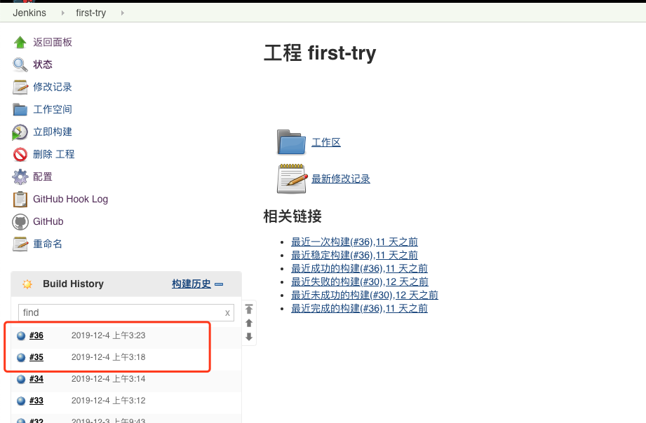

点击某个编译，选择 **控制台输出**，成功的日志类似如下：
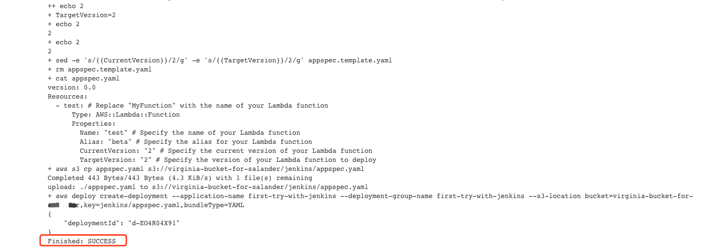

如果失败，请对应着日志提醒查看失败原因。
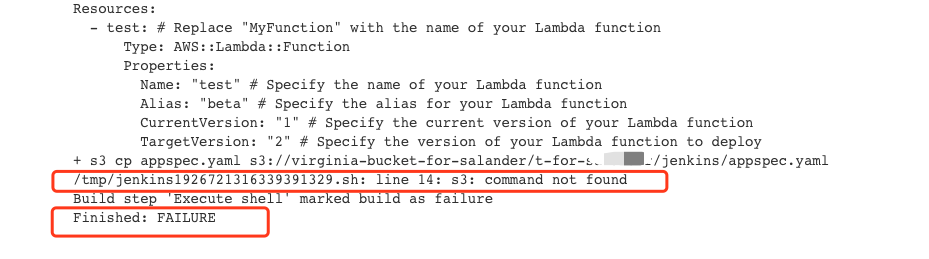

在 codedeploy的 deploy 列表中，点击某个具体 item 查看成功或者失败日志。
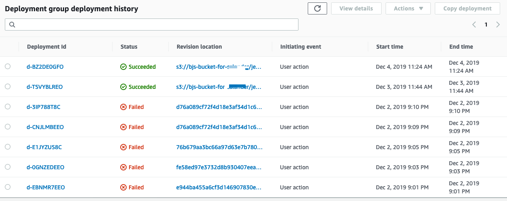

比如此错误信息告诉我们AppSpec文件不存在或者配置错误。


在修改错误后，成功信息如下。


## 实验二： Jenkins 利用 CodeBuild 以及 CodeDeploy 来实现 lambda 的自动更新
在实验一的基础上，我们会将 shell 的 build 步骤替换为用 CodeBuild 来实现。

### 步骤一：新增文件
在Github 源代码 repo 原文件的基础上，添加 [buildspec.yml](buildspec.yml) 文件，**修改替换文件中尖括号标注部分**（去掉尖括号）。修改完成后，``git push`` 到代码库下。

此文件用于 codebuild 配置文件。

### 选做：构建自定义的codebuild 环境(optional)
> codebuild 还可以自定义构建环境，在此步中，我们将学习如何实现。
> 如果不需要自定义环境，跳过此步。
> 如果您是第一次使用 codebuild，建议先跳过此步。

Codebuild本来就有自己的代码环境，例如python，Java这些。但有时还是不满足需求, 这种情况可以构建自定义的build环境，用**ECR**做镜像存储。

1. 点击下载[codebuild官方镜像文件](https://github.com/aws/aws-codebuild-docker-images/tree/master/ubuntu/standard/2.0)，并根据需要修改[Dockerfile](https://github.com/aws/aws-codebuild-docker-images/blob/master/ubuntu/standard/2.0/Dockerfile)，如预装软件，配置credentials等。

1. 在完成自定义后，将镜像传到自己的ECR repo下。点击跳转ECR控制台 并新建一个repo。

1. 镜像上传大概可以分为**登录**，**生成镜像**，**标记镜像**，**推送镜像**四个步骤。具体命令可以在ECR控制台 - 仓库 - 镜像查看。
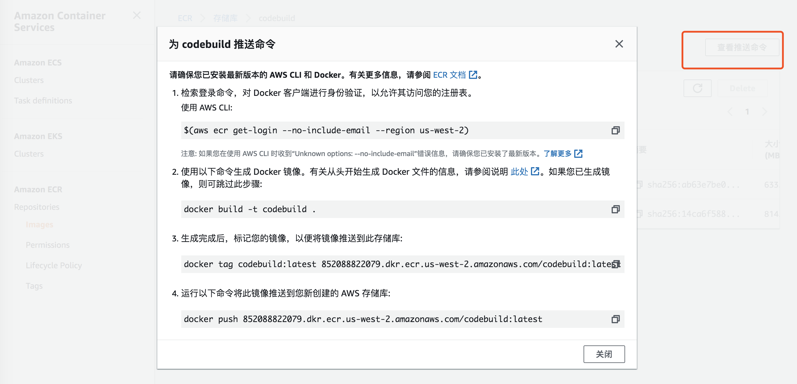

   1. 登录：```aws ecr get-login --no-include-email --region <your-region-code>```

   1. 生成自定义Docker镜像：修改serverless-cicd文件夹下的 **Dockerfile** 文件，删除或者剪裁不需要的环境。修改完之后用build命令生成image。示例命令如下。等待镜像上传。对于比较大的镜像，等待时间可能比较长。   
      ```
       docker build -t serverless-cicd .
      ```         
      
   1. 标记镜像：```docker tag```

   1. 推送镜像：使用```docker push```命令把image打包上传到[ECR](https://www.amazonaws.cn/en/ecr/)。
  
   1. 推送成功后，页面应该如下图所示：
     

### 步骤二：配置 CodeBuild
点击跳转至 [CodeBuild 控制台](https://console.amazonaws.cn/codesuite/codebuild/projects?region=cn-north-1)，点击 **create build project** （创建构建项目）。

项目名称任选，如 **jenkins-build**，源设置为 Github，填自己的 repo 链接以及刚才从 Github 生成的 Access Token。
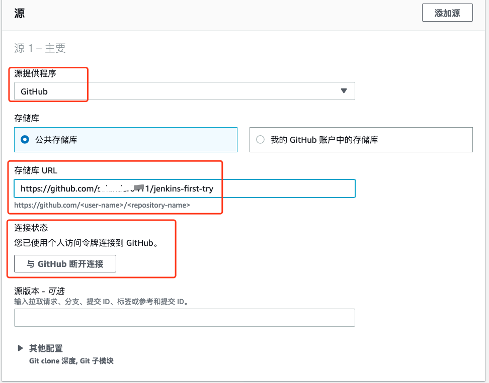

环境设置如下。默认请选择 **托管镜像** 。如果您刚才设置过自定义镜像并且想在此步使用，选择自定义镜像选项。
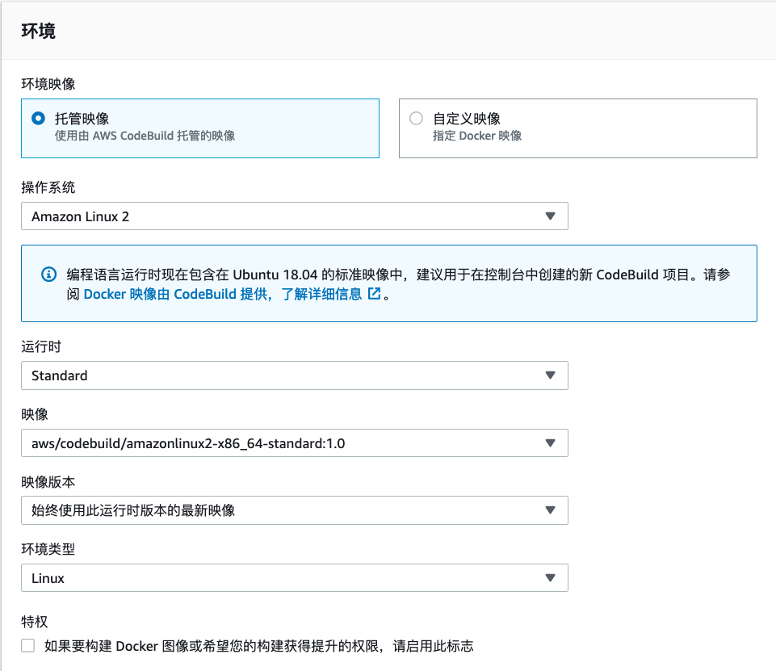

如果您是第一次使用 codebuild, 直接选择 **新服务角色**；如果您已经有 codebuild 角色，点击 **现有服务角色** 在下拉框中选择对应角色。
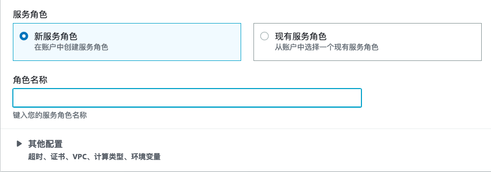

buildspec 保持默认值： **使用 buildspec 文件** ，以及名称留空即可。
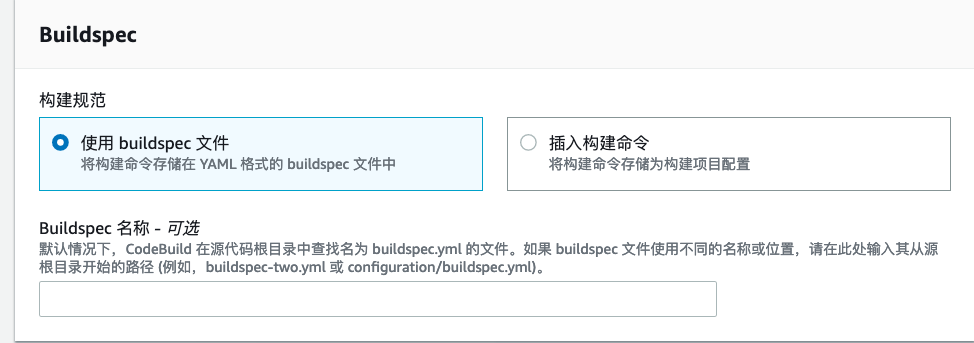

构件部分，选择无构件即可。其他部分保持默认值不变，点击 **创建构建项目**

### 步骤三：新建 Jenkins 项目   

新建项目之前，先安装 codebuild 的插件。点击 **系统管理** -- **插件管理(plugin)**
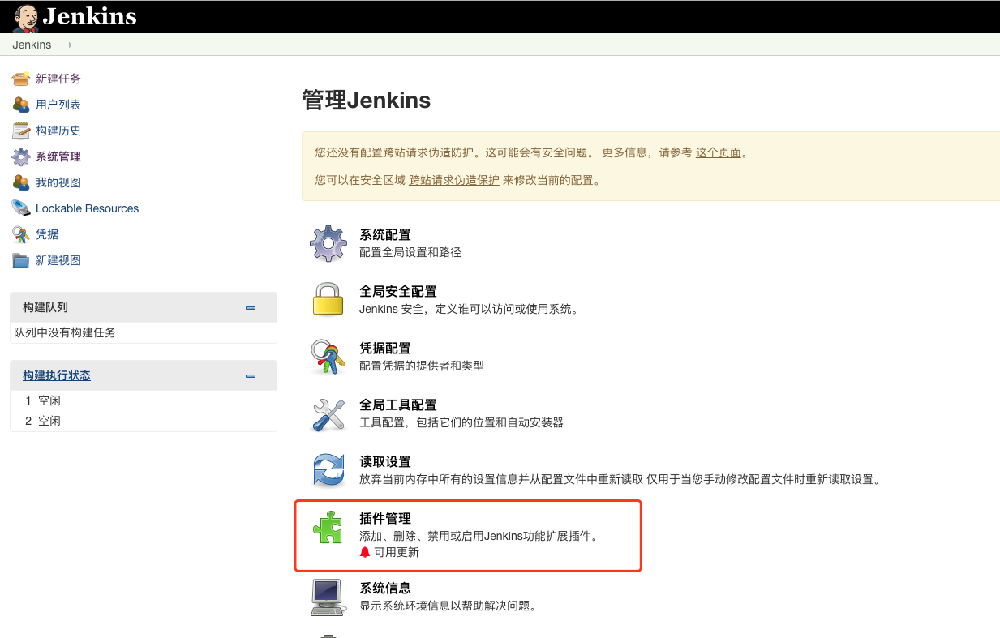

在可选插件里，选择 **AWS CodeBuild Plugin** 
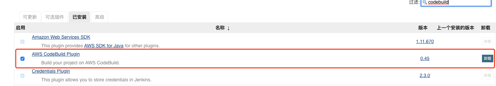

[comment]: <> (新建一Jenkins个项目，点击“Create a new project” -- "freestyle project" img/new-item.png)

[comment]: <> (配置Github项目的地址，源代码管理选择Git方式。img/source-github.png 触发构建，选择 Github hook trigger for GITScm polling )

重新新建一个 jenkins freestyle 的项目，或者修改刚才项目的构建步骤为 codebuild    
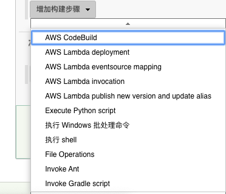

配置 AKSK , region, project-name，其他 project source details 因为我们已经在 codebuild 当中配置过，不用填写 override 值。   
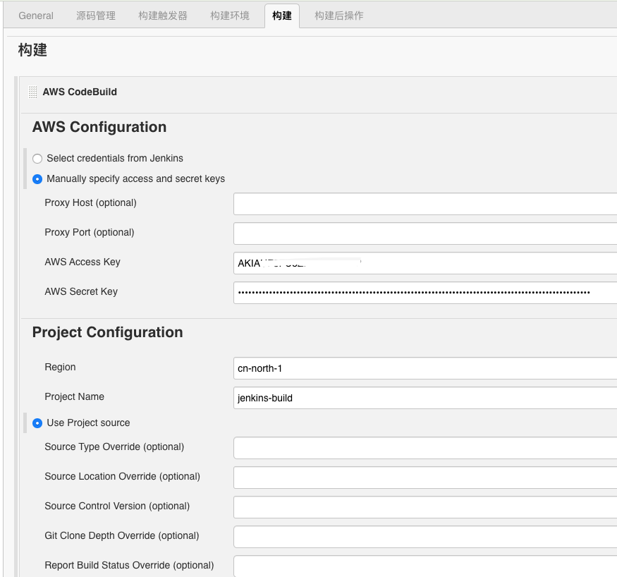

### 步骤四：测试效果
再次在提交代码到 github 当中，观察 Jenkins build 的触发。除了可以查看 jenkins 以及 codedeploy 的日志外，有关于构建过程，我们可以在 codebuild 中查看日志。
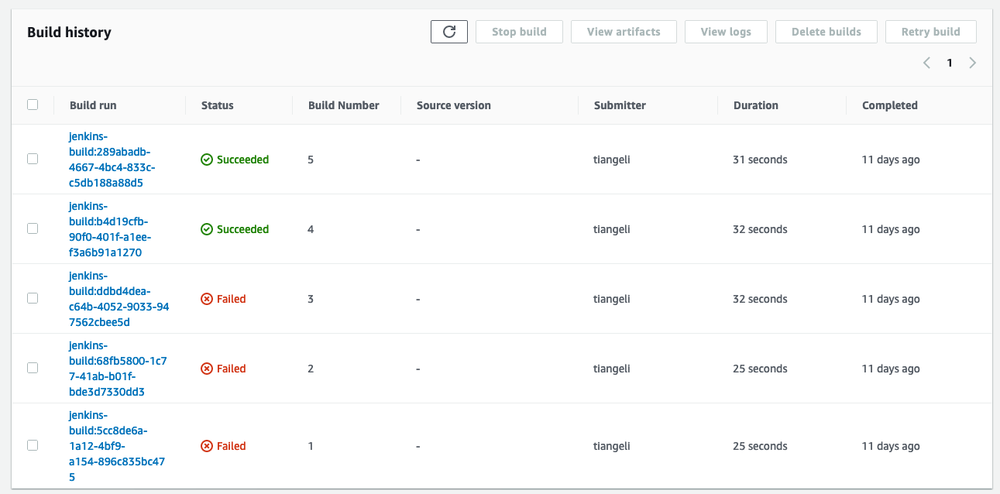

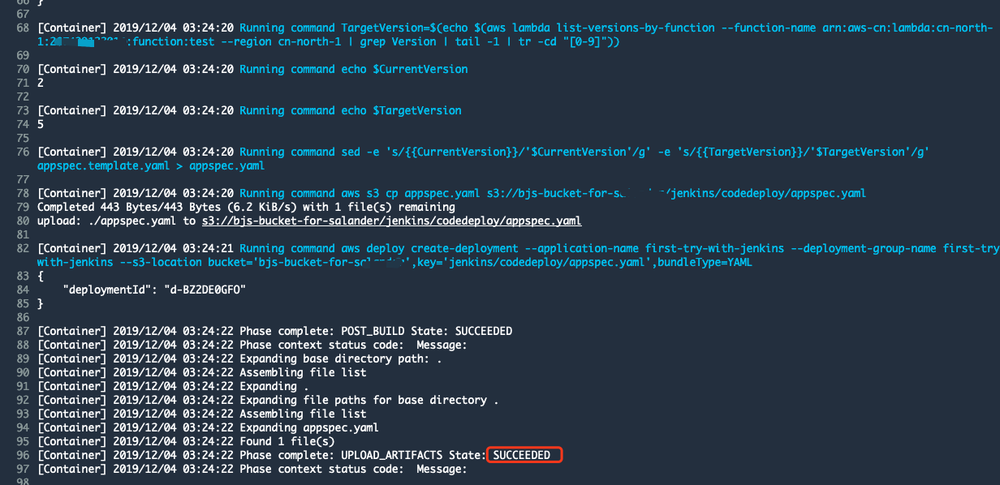
     
## 总结    
本文探讨了基于 serverless 场景下利用 Jenkins 结合 AWS code 系列产品 CICD 的实现，管理从代码的提交，到自动编译，到实现 lambda 新版本的发布以及安全的流量转移部署。