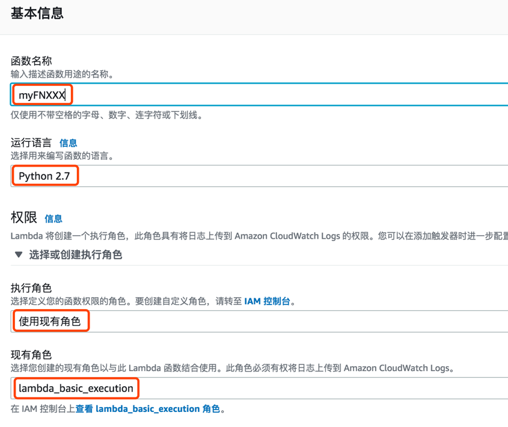
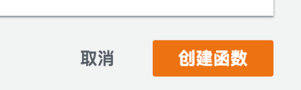
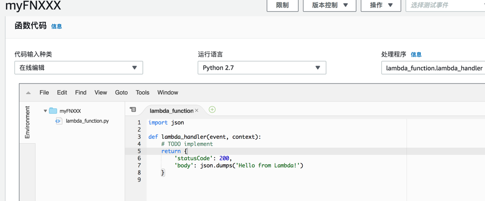
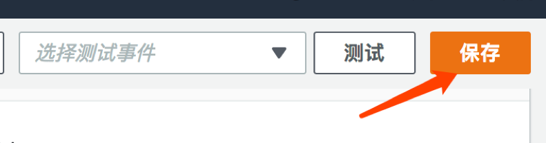
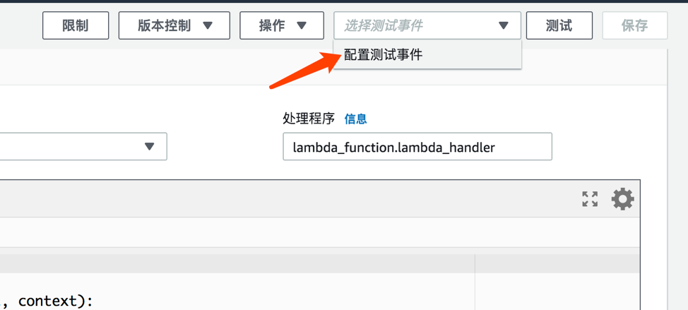
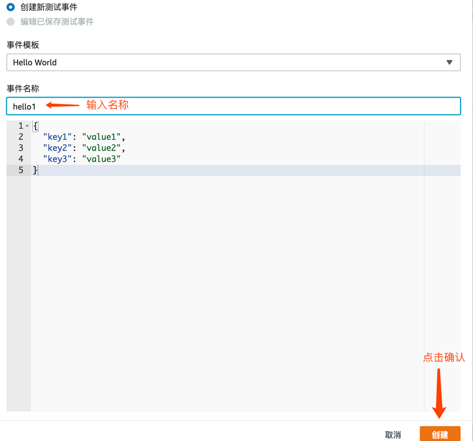
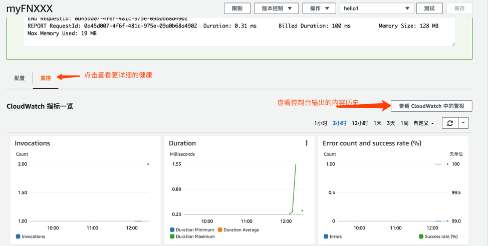
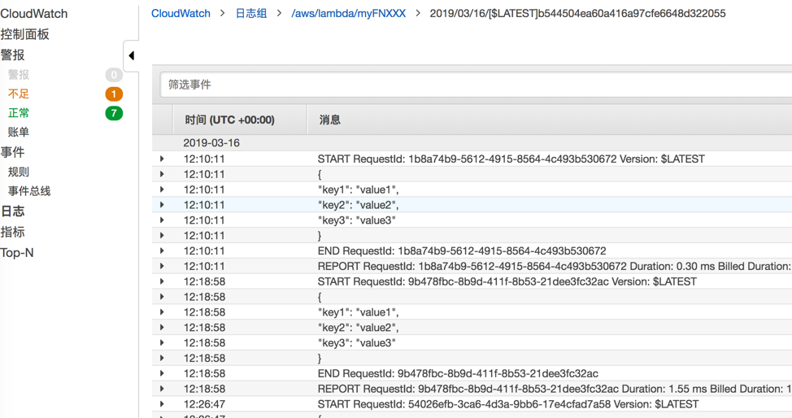

# 创建您的第一个LAMBDA 函数

在本lab当中，您将会学习如何创建一个基于 python2.7 的 lambda 函数，如何在lambda 控制台修改示例代码，并且查看输出结果以及日志。

## 详细步骤
1. 打开[AWS中国区控制台lambda界面](https://console.amazonaws.cn/lambda/home?region=cn-north-1#/) ，并点击创建函数.
   

1. 选择“从头开始创作”，输入您的函数名称，运行语言选择python2.7，执行角色选择使用现有角色，并在现有角色中选择lambda_basic_execution
   
   
1. 确认无误就可以点击“创建函数”了   
   

1. 创建完之后会自动跳转到lambda 函数页面，默认写了一个样例代码   
   

1. 编辑代码，在上述截图中的第五行插入一行```print(json.dumps(event, sort_keys=True, indent=4))```
   
   
1. **编辑完之后记得点击右上角的保存**
   
   
1. 点击右上角选择“配置测试事件”
   
   
1. 通过下图配置模拟触发事件，测试刚刚创建的函数。
   
   
1. 点击测试
   
   
1. 查看运行结果
   
 
1. 多尝试模拟运行几次。之后您可以打开Cloudwatch 查看更详尽的报告，还可以点击下图“查看CLoudwatch 中的警报”，查看历史控制台输出.
   
   
1. 历史输出
   
 
 
## 下一步
您可以回到[主目录](README.md)回顾总结或者进行其他实验。