# 创建SERVERLESS架构的调查问卷表单

在本lab中，您将会学习如何利用 **[Lambda]((https://www.amazonaws.cn/lambda/))** , **[API Gateway](https://www.amazonaws.cn/api-gateway/?nc2=h_l3_n)** 以及 **[DynamoDB]((https://www.amazonaws.cn/dynamodb/?nc2=h_l3_db))** 制作一个serverless架构的问卷表达，并且用 **[IAM](https://www.amazonaws.cn/iam/?nc2=h_l3_al)** 做权限管理，**[CloudWatch](https://www.amazonaws.cn/cloudwatch/?nc2=h_l3_dm)** 做资源监控。在本章节的最后，我们还将通过一个简单的示例演示lambda的冷启动以及复用效果。

## 架构图
  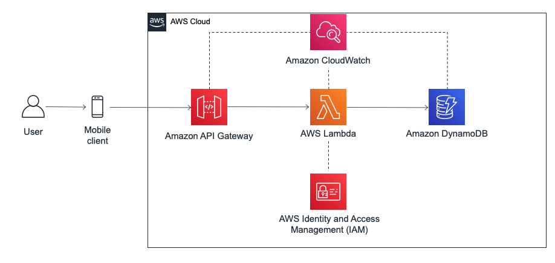


## 前提条件
1. 本文实验基于AWS中国区北京区(cn-north-1)作示例。所有控制台链接均直接连接到北京区console。如使用海外区账号，请不要点击此直达连接，在global控制台选择相应产品即可。
1. 如果您使用的是AWS中国区账号，账号默认屏蔽了80,8080,443三个端口，需要先申请打开443端口才可以正常使用API Gateway的服务。如果是海外账号，没有此限制。
1. 如何判断自己的账号是中国区账号还是海外区账号？请查看自己的控制台链接，console.amazonaws.cn为中国区，console.aws.amazon.com为海外区账号。
1. 为了防止资源重名，请在创建资源名称时替代下述的“XX”。

## 实验步骤
1. 下载lambda 代码包    
共两个demo code，分别用于两个lambda函数。点击下载[Survery-Survery.zip](code/Survey-Survey.zip) 以及 [SurverySubmit.zip](code/SurveySubmit.zip)

1. 创建IAM Role   
   - 打开[IAM Role 页面](https://console.amazonaws.cn/iam/home?#/roles)，选择创建角色并且选择lambda作为使用角色的服务
      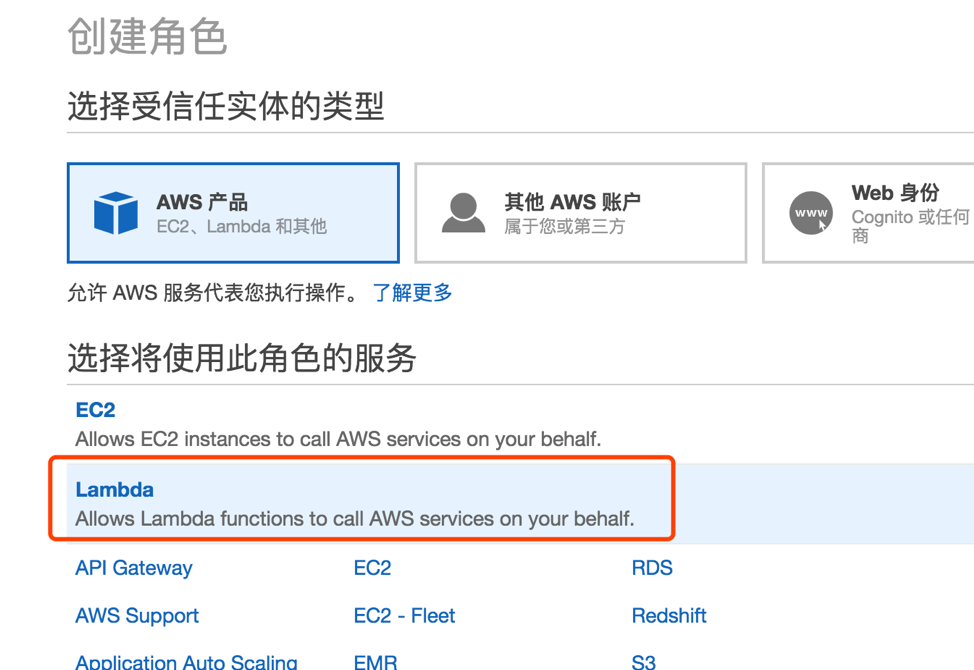

   - 添加Role权限    
   在下一屏幕分别添加"AmazonDynamoDBFullAccess", "CloudWatchLogsFullAccess", "AWSLambdaBasicExecutionRole" 三个策略。
   添加完之后进入第三步，直接点击下一步即可。
   
   - 审核无误后创建角色
      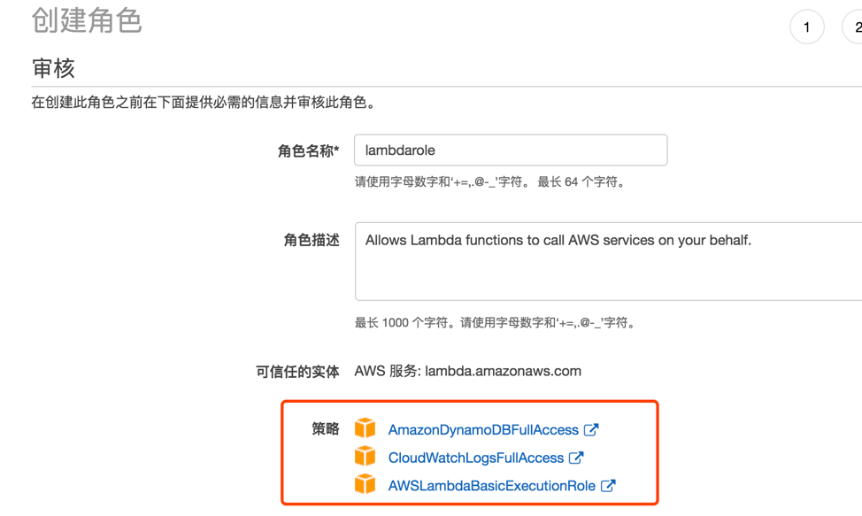

1. 创建DynamoDB Table. 打开[DynamoDB控制台](https://console.amazonaws.cn/dynamodb/home?region=cn-north-1#)，点击创建表。输入表名称，主键名称为``id``
   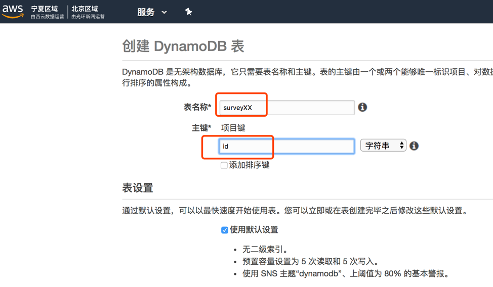

1. 创建一个名为survey-a-XX的lambda
   1. 角色设置：选择在前面步骤创建的lambdarole。
      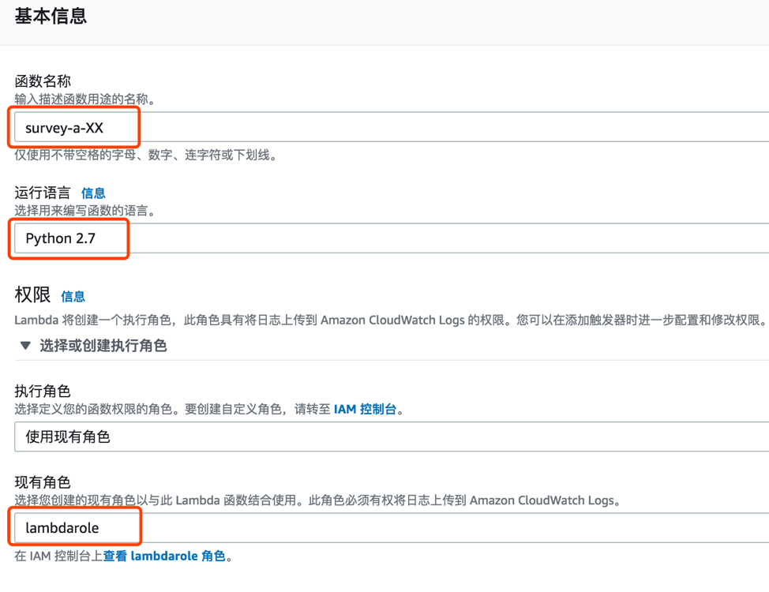

   1. 上传代码Survery-survery.zip
      
   
      

   1. 修改程序主入口为```survey.lambda_handler```，然后 **保存** ，就成功部署survey-a-XX函数
   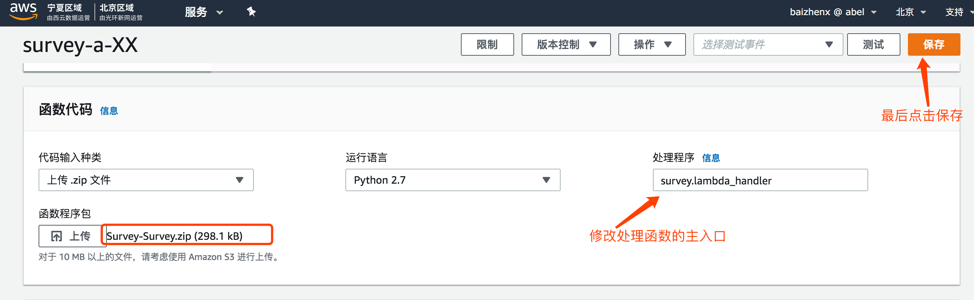
   
1. 创建一个名为survey-b-XX 的lambda
   1. 角色设置
      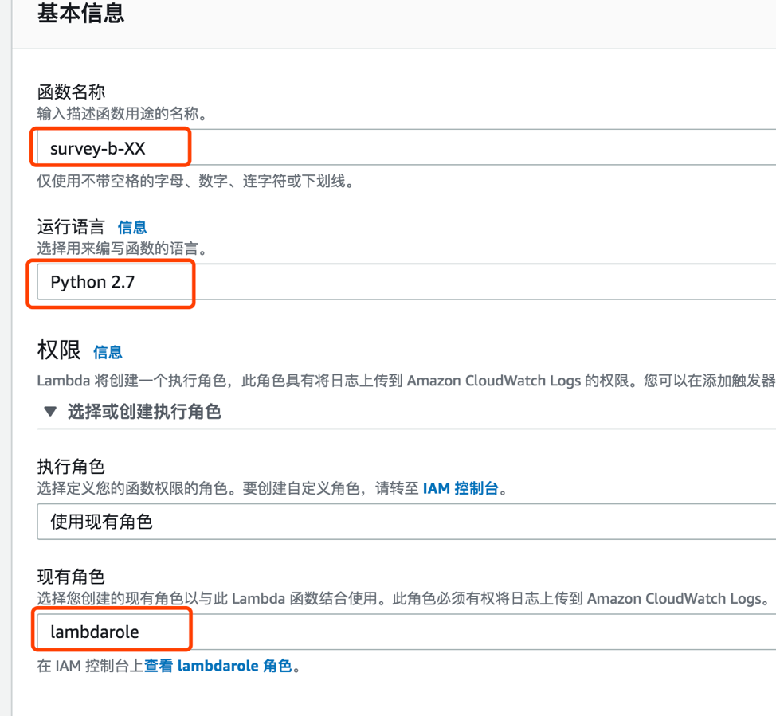
   1. 代码上传
      
   1. 修改程序主入口为```survey_submit.lambda_handler``` 并点击 **保存**，成功部署survey-b-XX函数。
      
   1. 修改b函数的config.yaml文件。 在文件第一行添加下图字段，并输入在步骤3中创建的Dynamodb Table的名称。最后点击右上角的保存即可
      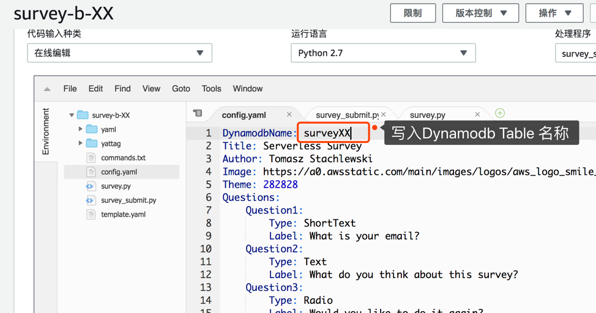

1. 创建API Gateway并进行配置    
   1. 创建API：点击跳转到[API Gateway控制台](https://console.amazonaws.cn/apigateway/home?region=cn-north-1#/apis)，并点击创建API，名为surveyAPI-XX  
      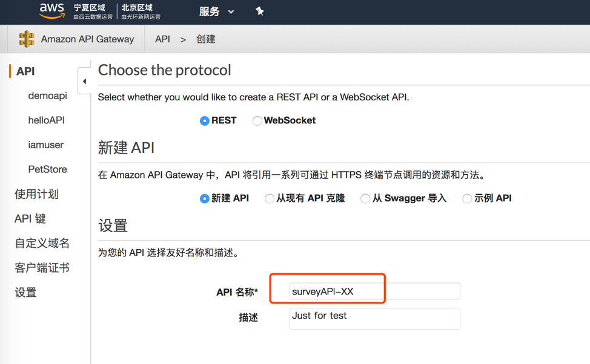
   1. 选择 **创建资源** ，资源名称为newsurvey
      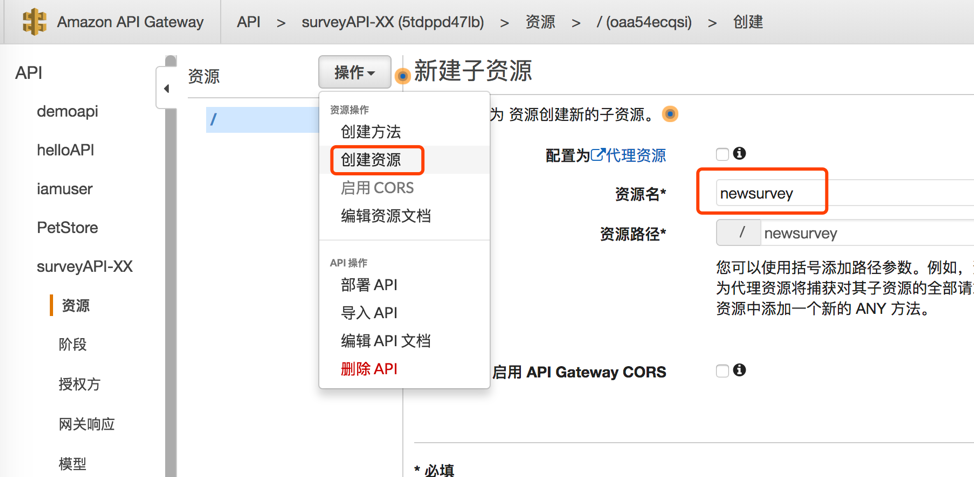
   1. **创建方法** 。 选择创建“ANY”，代表接受任何种类的https 请求。
      
   1. **方法设置**。 集成环境选择Lambda函数，记得勾选lambda 代理集成，并选择survey-a-xx Lambda函数。
      
   1. 同样的方法，在根路径下创建/submitsurvey资源，并创建“ANY”方法，这里选择的lambda 函数应该是survey-b-xx。
   1. 最后选择部署API,并设置**部署阶段** 
      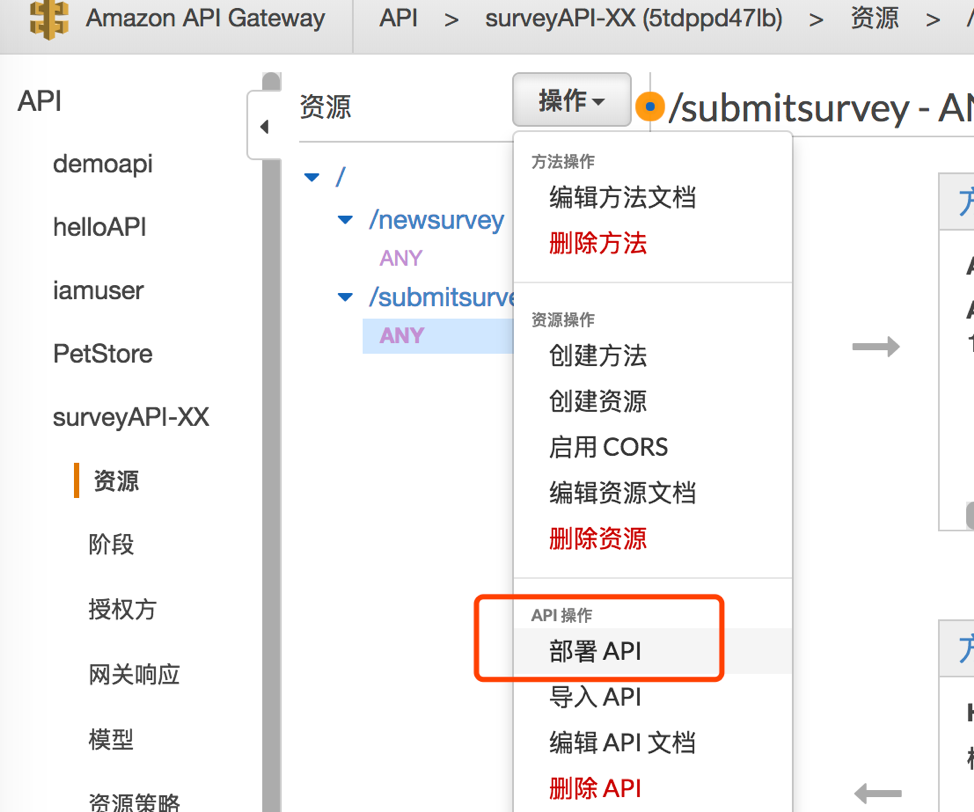 
      

1. **测试**    
   1. 访问页面给出的URL，并在url路径后添加 **/newsurvey** 指定访问/newsurvey API。
      
   1. 如下图可以看到已经成功部署了Serverless的问卷，可以填写这个表单，查看效果。
      
   1. 到Dynamodb服务中查看填写表单内容的存入。
      
   1. 至此，一个无服务架构的表单系统已经完成。
   
1. **额外关注** : survey-a-XX 函数冷启动情况    
  - 请多次访问 survey html页面，多次触发lambda。然后打开survey lambda函数。下述代码截图显示了如何复用全局变量。
    
  - 现在打开a 函数的监控，到cloudwatch 查看详细logs
    
  - 点击下图右上角的“查看cloudwatch 中的警报”
    
  - 选择刚刚触发产生的logs
    
  - 查看详细logs，请看下图：
    
    

## 下一步
现在您可以回到[主目录](README.md)回顾总结或者进行其他实验。