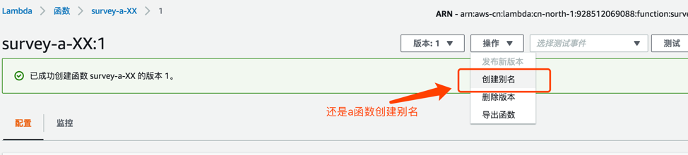
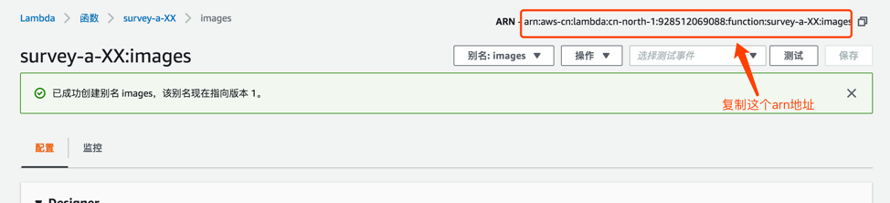
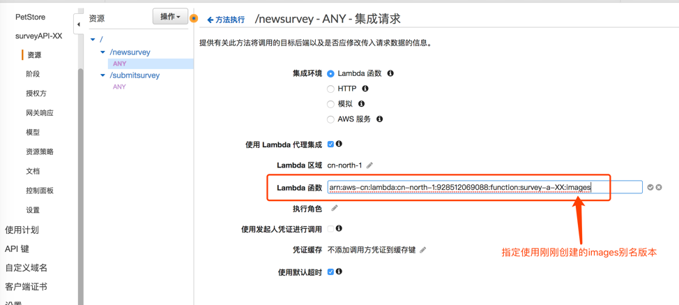
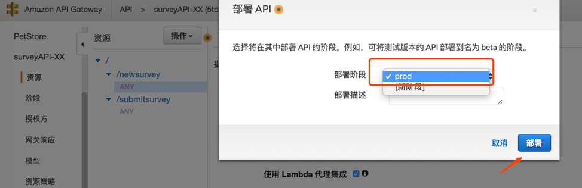
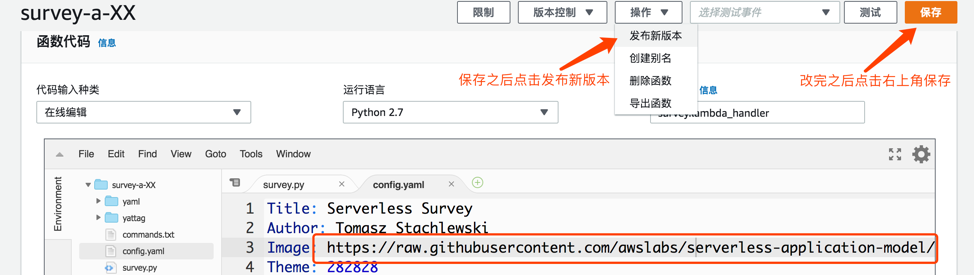
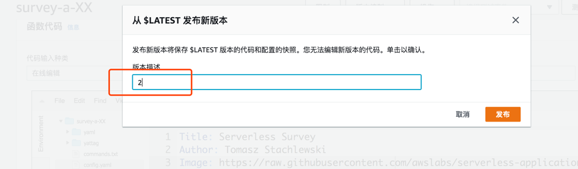
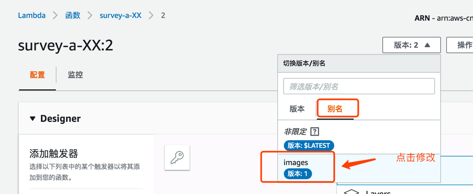
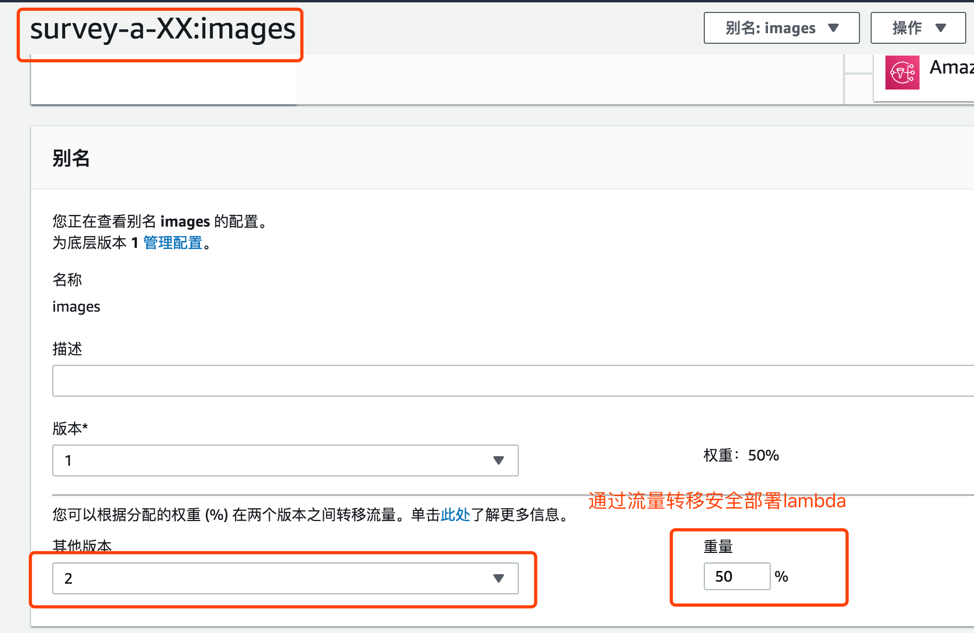

# 通过流量转移安全部署 AWS LAMBDA 版本
在本节，您将会学习如何通过调整 AWS Lambda 不同版本的权重，实现新版本的安全发布部署。

## 前提条件
1. 本文实验基于AWS中国区北京区(cn-north-1)作示例。所有控制台链接均直接连接到北京区console。如使用海外区账号，请不要点击此直达连接，在global控制台选择相应产品即可。
1. 如果您使用的是AWS中国区账号，账号默认屏蔽了80,8080,443三个端口，需要先申请打开443端口才可以正常使用API Gateway的服务。如果是海外账号，没有此限制。
1. 如何判断自己的账号是中国区账号还是海外区账号？请查看自己的控制台链接，console.amazonaws.cn为中国区，console.aws.amazon.com为海外区账号。
1. 在实验是基于实验二[创建SERVERLESS架构的调查问卷表单](lab2.md)创建的lambda函数,但如果您有其它已有的lambda函数，也可以根据步骤提醒做自定义的验证。

## 详细步骤
1. 打开在[上一个实验](lab2.md)中部署的survey-a-xx，并选择发布新版本
   

1. 输入版本号：1，然后点击发布
   
  
1. 发布完1版本之后，我们创建lambda 别名，并指定名称为images，设置当前别名指向到刚刚创建的1版本。最后点击创建.
   
   
   
1. 创建完images别名之后，请复制右上角的arn地址。
   

1. 打开[API Gateway](https://console.amazonaws.cn/apigateway/home?region=cn-north-1#/apis)。选择在第二个实验中创建的surveyAPI-XX 页面，并编辑/newsurvey 下的ANY 方法。点击进入设置“集成请求”。
   

1. 点击编辑Lambda 函数的arn，粘贴上述images 的arn并保存
   

1. 选择确定授权当前API 访问Lambda函数
   
   
1. 对API Gateway更改设置后，不要忘记**重新部署**。在这里我们仍然部署到prod阶段。
   
   

1. 访问原来的API Gateway: https://XXXXX(您的路径).execute-api.cn-north-1.amazonaws.com.cn/prod/newsurvey，我们可以发现因为没有做任何改动，页面效果和原来一样。
   
   
1. 现在模拟修改lambda代码，并使用别名部署新版本lambda。打开survey-a-XX lambda函数，编辑config.yml 文件。如下图，替换Image 的图片网址为[此图片网址](https://raw.githubusercontent.com/awslabs/serverless-application-model/master/aws_sam_introduction.png).
   

1. 改完之后如下图，然后点击右上角保存，最后点击“发布新版本”。
   

1. 版本描述写2
   

1. 现在打开之前创建的images 别名
   
   
1. 下拉页面，配置其他版本为2，权重设置为50%。并点击右上角保存。
   
   
1. 再次访问访问原来的API Gateway ：https://XXXXX(您的路径).execute-api.cn-north-1.amazonaws.com.cn/prod/newsurvey，多刷几次网页看看效果。
   
   
## 下一步
现在您可以回到[主目录](README.md)回顾总结或者进行其他实验。